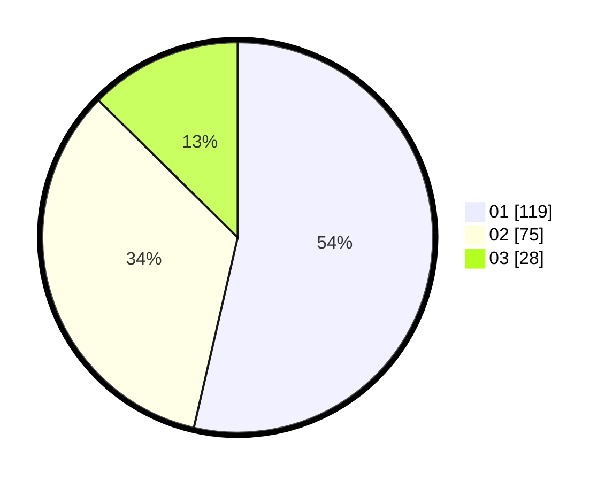

# Hasil

Hasil perolehan suara paslon dapat dilihat pada file paslon-01.txt, paslon-02.txt, dan paslon-03.txt.

Jika tidak ada, artinya data tersebut belum ada pada SIREKAP.

## Perolehan Suara

 * Paslon 01: **119**.
 * Paslon 02: **75**.
 * Paslon 03: **28**.

## Foto C Plano

https://sirekap-obj-formc.kpu.go.id/35fc/pemilu/ppwp/31/75/01/10/01/3175011001053-20240214-200102--51183b4b-02db-4a38-96c3-4e97fefcb684.jpg

https://sirekap-obj-formc.kpu.go.id/35fc/pemilu/ppwp/31/75/01/10/01/3175011001053-20240215-032956--2f6a9c8e-5159-4985-8311-1683da2e2dbf.jpg
