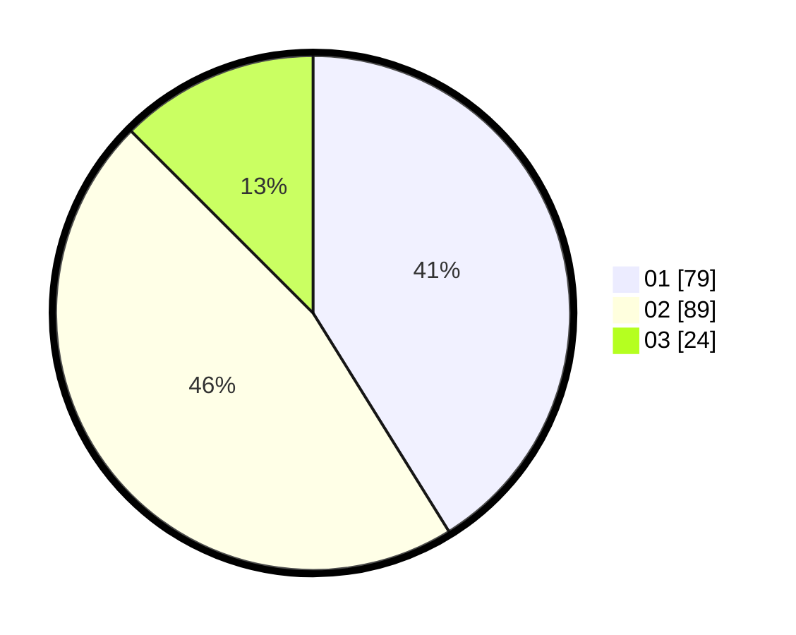

# Hasil

Hasil perolehan suara paslon dapat dilihat pada file paslon-01.txt, paslon-02.txt, dan paslon-03.txt.

Jika tidak ada, artinya data tersebut belum ada pada SIREKAP.

## Perolehan Suara

 * Paslon 01: **79**.
 * Paslon 02: **89**.
 * Paslon 03: **24**.

## Foto C Plano

https://sirekap-obj-formc.kpu.go.id/c503/pemilu/ppwp/31/75/01/10/01/3175011001057-20240214-192802--d675fea3-0f85-4b70-8281-50eda40ff01b.jpg

https://sirekap-obj-formc.kpu.go.id/c503/pemilu/ppwp/31/75/01/10/01/3175011001057-20240214-192909--38b53ef8-b81b-48e2-b1eb-c81474f127f5.jpg

https://sirekap-obj-formc.kpu.go.id/c503/pemilu/ppwp/31/75/01/10/01/3175011001057-20240214-192926--8893a073-5ca8-4056-bee7-7ec34a8179f7.jpg

## DATA PEMILIH TETAP

Jumlah pemilih dalam DPT: **255**.
 * L: **124**.
 * P: **131**.

## DATA PENGGUNA HAK PILIH

Jumlah pengguna hak pilih dalam DPT: **193**.
 * L: **90**.
 * P: **103**.

Jumlah pengguna hak pilih dalam DPTb: **1**.
 * L: **0**.
 * P: **1**.

Jumlah pengguna hak pilih dalam DPK: **3**.
 * L: **1**.
 * P: **2**.

Jumlah pengguna hak pilih: **197**.
 * L: **91**.
 * P: **106**.

## JUMLAH SUARA SAH DAN TIDAK SAH

JUMLAH SELURUH SUARA SAH: **192**.

JUMLAH SUARA TIDAK SAH: **5**.

JUMLAH SELURUH SUARA SAH DAN SUARA TIDAK SAH: **197**.
