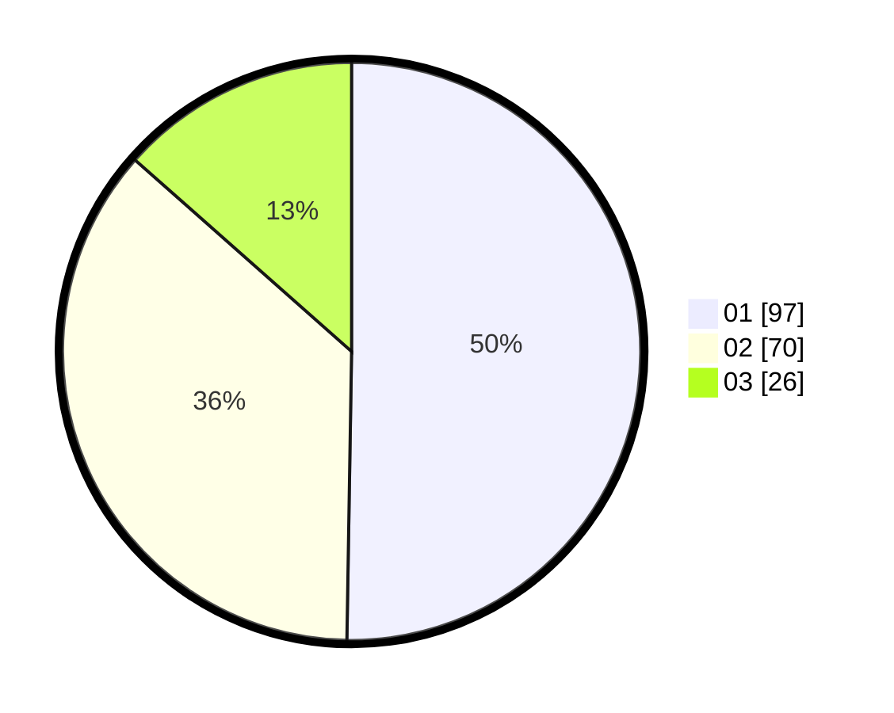

# Hasil

Hasil perolehan suara paslon dapat dilihat pada file paslon-01.txt, paslon-02.txt, dan paslon-03.txt.

Jika tidak ada, artinya data tersebut belum ada pada SIREKAP.

## Perolehan Suara

 * Paslon 01: **97**.
 * Paslon 02: **70**.
 * Paslon 03: **26**.

## Foto C Plano

https://sirekap-obj-formc.kpu.go.id/4dac/pemilu/ppwp/31/75/01/10/01/3175011001058-20240214-211017--0f2907c8-4af1-4c1d-9513-a893bb1ed77f.jpg

https://sirekap-obj-formc.kpu.go.id/4dac/pemilu/ppwp/31/75/01/10/01/3175011001058-20240214-211403--d1a5bcab-0706-44d9-9c8f-9b029f395faf.jpg
