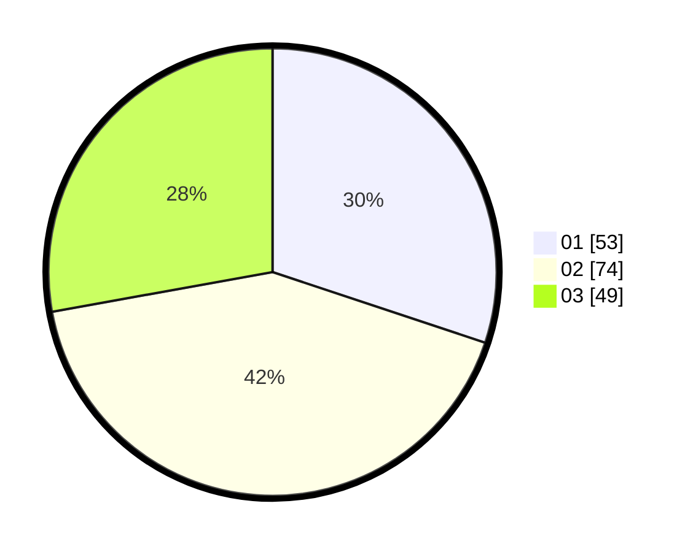

# Hasil

Hasil perolehan suara paslon dapat dilihat pada file paslon-01.txt, paslon-02.txt, dan paslon-03.txt.

Jika tidak ada, artinya data tersebut belum ada pada SIREKAP.

## Perolehan Suara

 * Paslon 01: **53**.
 * Paslon 02: **74**.
 * Paslon 03: **49**.

## Foto C Plano

https://sirekap-obj-formc.kpu.go.id/adb6/pemilu/ppwp/31/75/01/10/01/3175011001060-20240214-202205--3211e478-e2d5-44e5-a91f-a08895418417.jpg

https://sirekap-obj-formc.kpu.go.id/adb6/pemilu/ppwp/31/75/01/10/01/3175011001060-20240214-212021--d61e9ae5-06ae-4fb4-83b6-33754558bcec.jpg

https://sirekap-obj-formc.kpu.go.id/adb6/pemilu/ppwp/31/75/01/10/01/3175011001060-20240214-202211--3704a09d-ad02-46fd-b54e-f88de9d33b84.jpg
