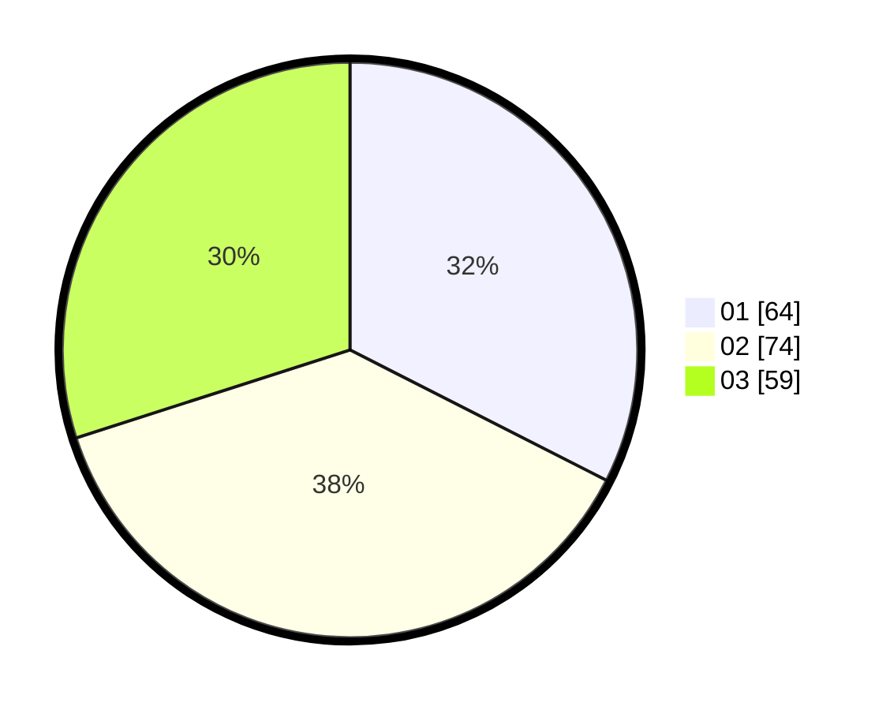

# Hasil

Hasil perolehan suara paslon dapat dilihat pada file paslon-01.txt, paslon-02.txt, dan paslon-03.txt.

Jika tidak ada, artinya data tersebut belum ada pada SIREKAP.

## Perolehan Suara

 * Paslon 01: **64**.
 * Paslon 02: **74**.
 * Paslon 03: **59**.

## Foto C Plano

https://sirekap-obj-formc.kpu.go.id/d545/pemilu/ppwp/31/75/01/10/01/3175011001061-20240214-210330--6b4e2160-f439-45f6-8f4e-b130eece7f9f.jpg

https://sirekap-obj-formc.kpu.go.id/d545/pemilu/ppwp/31/75/01/10/01/3175011001061-20240214-210147--854768c6-10a2-4f3b-94c7-a7145d6db353.jpg

https://sirekap-obj-formc.kpu.go.id/d545/pemilu/ppwp/31/75/01/10/01/3175011001061-20240214-210029--189708ee-0577-4e4a-8b6e-41684cd5934f.jpg
