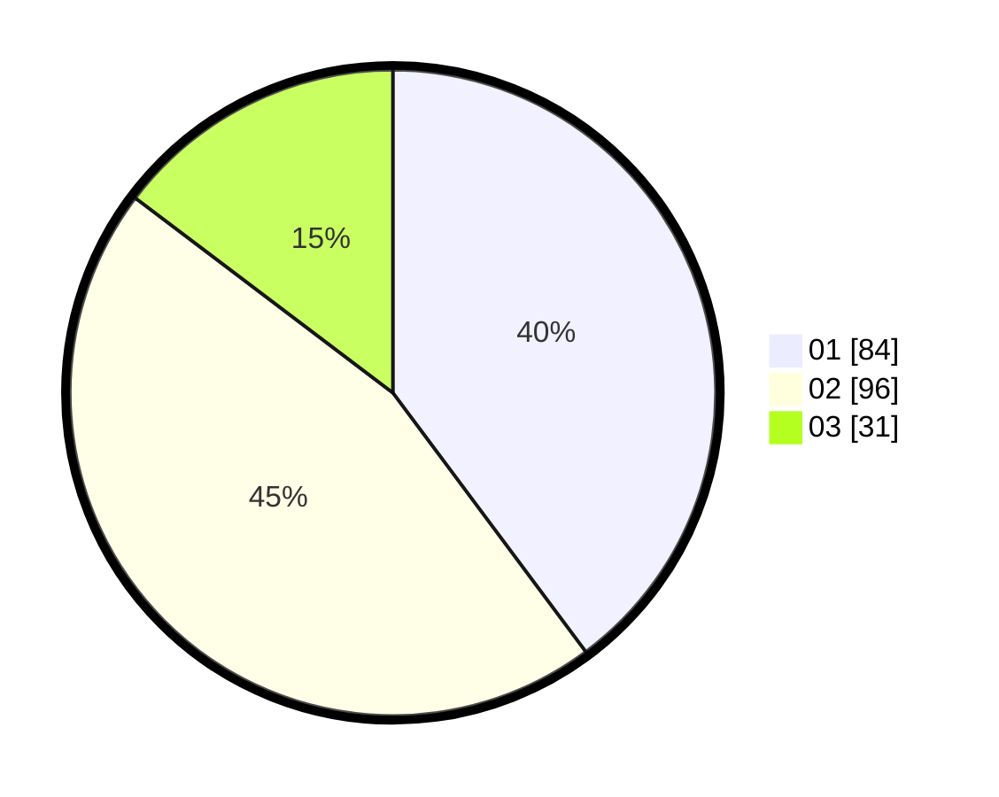

# Hasil

Hasil perolehan suara paslon dapat dilihat pada file paslon-01.txt, paslon-02.txt, dan paslon-03.txt.

Jika tidak ada, artinya data tersebut belum ada pada SIREKAP.

## Perolehan Suara

 * Paslon 01: **84**.
 * Paslon 02: **96**.
 * Paslon 03: **31**.

## Foto C Plano

https://sirekap-obj-formc.kpu.go.id/8275/pemilu/ppwp/31/75/01/10/01/3175011001068-20240214-160137--eb541ea6-3af6-4e04-9013-08342445e40c.jpg

https://sirekap-obj-formc.kpu.go.id/8275/pemilu/ppwp/31/75/01/10/01/3175011001068-20240214-184907--e74ef87b-8e05-4464-8bc6-c69af2b5058c.jpg

https://sirekap-obj-formc.kpu.go.id/8275/pemilu/ppwp/31/75/01/10/01/3175011001068-20240214-185740--18488e98-af57-4141-b368-5bee97d10637.jpg

## DATA PEMILIH TETAP

Jumlah pemilih dalam DPT: **261**.
 * L: **131**.
 * P: **130**.

## DATA PENGGUNA HAK PILIH

Jumlah pengguna hak pilih dalam DPT: **213**.
 * L: **105**.
 * P: **108**.

Jumlah pengguna hak pilih dalam DPTb: **1**.
 * L: **0**.
 * P: **1**.

Jumlah pengguna hak pilih dalam DPK: **0**.
 * L: **0**.
 * P: **0**.

Jumlah pengguna hak pilih: **214**.
 * L: **105**.
 * P: **109**.

## JUMLAH SUARA SAH DAN TIDAK SAH

JUMLAH SELURUH SUARA SAH: **211**.

JUMLAH SUARA TIDAK SAH: **3**.

JUMLAH SELURUH SUARA SAH DAN SUARA TIDAK SAH: **214**.
