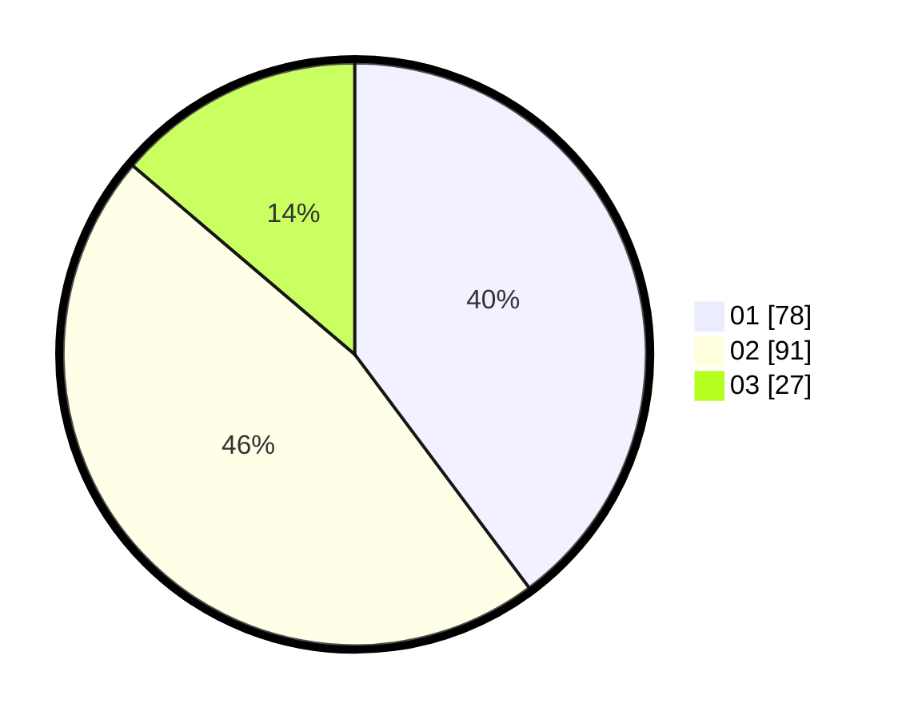

# Hasil

Hasil perolehan suara paslon dapat dilihat pada file paslon-01.txt, paslon-02.txt, dan paslon-03.txt.

Jika tidak ada, artinya data tersebut belum ada pada SIREKAP.

## Perolehan Suara

 * Paslon 01: **78**.
 * Paslon 02: **91**.
 * Paslon 03: **27**.

## Foto C Plano

https://sirekap-obj-formc.kpu.go.id/4ae4/pemilu/ppwp/31/75/01/10/01/3175011001069-20240214-155016--82c51127-1bb5-4705-8fd5-43bec4f19c1f.jpg

https://sirekap-obj-formc.kpu.go.id/4ae4/pemilu/ppwp/31/75/01/10/01/3175011001069-20240216-145726--7d7b91f0-4e5c-4515-a2aa-eb735e98e3ac.jpg

https://sirekap-obj-formc.kpu.go.id/4ae4/pemilu/ppwp/31/75/01/10/01/3175011001069-20240216-145725--2290bdb4-868f-43b0-98e1-879feb01bda7.jpg

## DATA PEMILIH TETAP

Jumlah pemilih dalam DPT: **250**.
 * L: **132**.
 * P: **126**.

## DATA PENGGUNA HAK PILIH

Jumlah pengguna hak pilih dalam DPT: **203**.
 * L: **106**.
 * P: **97**.

Jumlah pengguna hak pilih dalam DPTb: **1**.
 * L: **0**.
 * P: **1**.

Jumlah pengguna hak pilih dalam DPK: **0**.
 * L: **0**.
 * P: **0**.

Jumlah pengguna hak pilih: **204**.
 * L: **106**.
 * P: **98**.

## JUMLAH SUARA SAH DAN TIDAK SAH

JUMLAH SELURUH SUARA SAH: **196**.

JUMLAH SUARA TIDAK SAH: **7**.

JUMLAH SELURUH SUARA SAH DAN SUARA TIDAK SAH: **203**.
