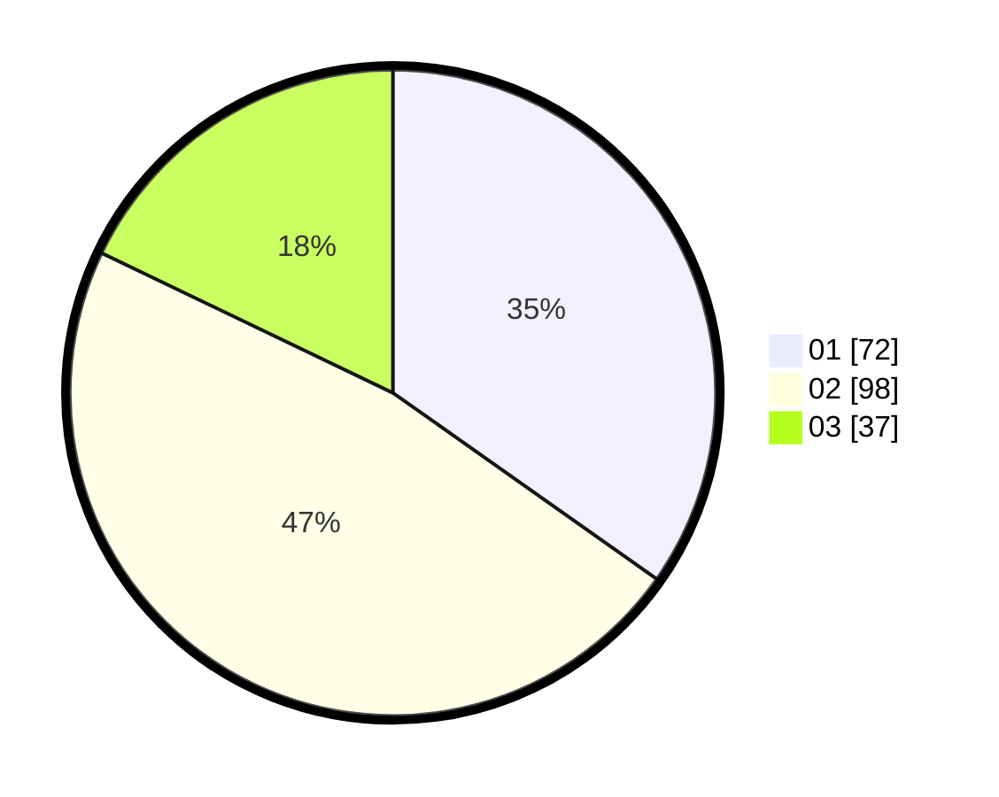

# Hasil

Hasil perolehan suara paslon dapat dilihat pada file paslon-01.txt, paslon-02.txt, dan paslon-03.txt.

Jika tidak ada, artinya data tersebut belum ada pada SIREKAP.

## Perolehan Suara

 * Paslon 01: **72**.
 * Paslon 02: **98**.
 * Paslon 03: **37**.

## Foto C Plano

https://sirekap-obj-formc.kpu.go.id/938b/pemilu/ppwp/31/75/01/10/01/3175011001070-20240214-201950--bfff838b-fdd6-44ff-917a-edb8779c90ef.jpg

https://sirekap-obj-formc.kpu.go.id/938b/pemilu/ppwp/31/75/01/10/01/3175011001070-20240216-134211--ccda5185-52d7-43ae-ab98-05a6bee2d912.jpg

https://sirekap-obj-formc.kpu.go.id/938b/pemilu/ppwp/31/75/01/10/01/3175011001070-20240216-134216--fb71a2e2-f71f-4a08-bb1f-944bf5fabaf2.jpg
