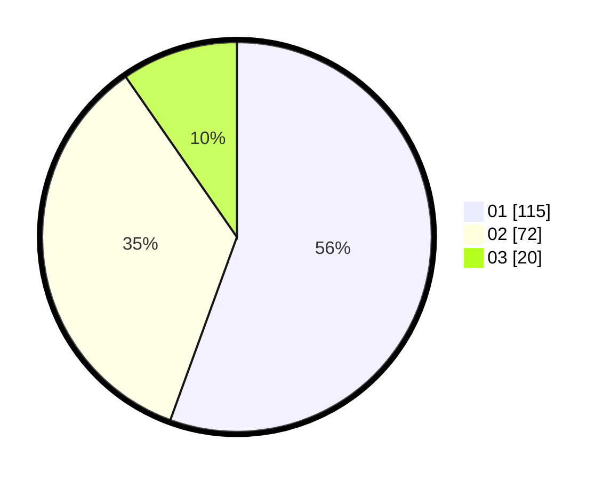

# Hasil

Hasil perolehan suara paslon dapat dilihat pada file paslon-01.txt, paslon-02.txt, dan paslon-03.txt.

Jika tidak ada, artinya data tersebut belum ada pada SIREKAP.

## Perolehan Suara

 * Paslon 01: **115**.
 * Paslon 02: **72**.
 * Paslon 03: **20**.

## Foto C Plano

https://sirekap-obj-formc.kpu.go.id/97e2/pemilu/ppwp/31/75/01/10/01/3175011001075-20240215-102409--a941a395-4ebe-468e-9d10-21f73541c7f7.jpg

https://sirekap-obj-formc.kpu.go.id/97e2/pemilu/ppwp/31/75/01/10/01/3175011001075-20240215-102414--9e6b93ac-6726-4f10-a479-596724829b8c.jpg

https://sirekap-obj-formc.kpu.go.id/97e2/pemilu/ppwp/31/75/01/10/01/3175011001075-20240215-102420--8ec0e35f-c863-420d-8b3e-4d9719f36db9.jpg

## DATA PEMILIH TETAP

Jumlah pemilih dalam DPT: **275**.
 * L: **130**.
 * P: **145**.

## DATA PENGGUNA HAK PILIH

Jumlah pengguna hak pilih dalam DPT: **205**.
 * L: **91**.
 * P: **114**.

Jumlah pengguna hak pilih dalam DPTb: **0**.
 * L: **0**.
 * P: **0**.

Jumlah pengguna hak pilih dalam DPK: **5**.
 * L: **3**.
 * P: **2**.

Jumlah pengguna hak pilih: **210**.
 * L: **94**.
 * P: **116**.

## JUMLAH SUARA SAH DAN TIDAK SAH

JUMLAH SELURUH SUARA SAH: **207**.

JUMLAH SUARA TIDAK SAH: **3**.

JUMLAH SELURUH SUARA SAH DAN SUARA TIDAK SAH: **210**.
