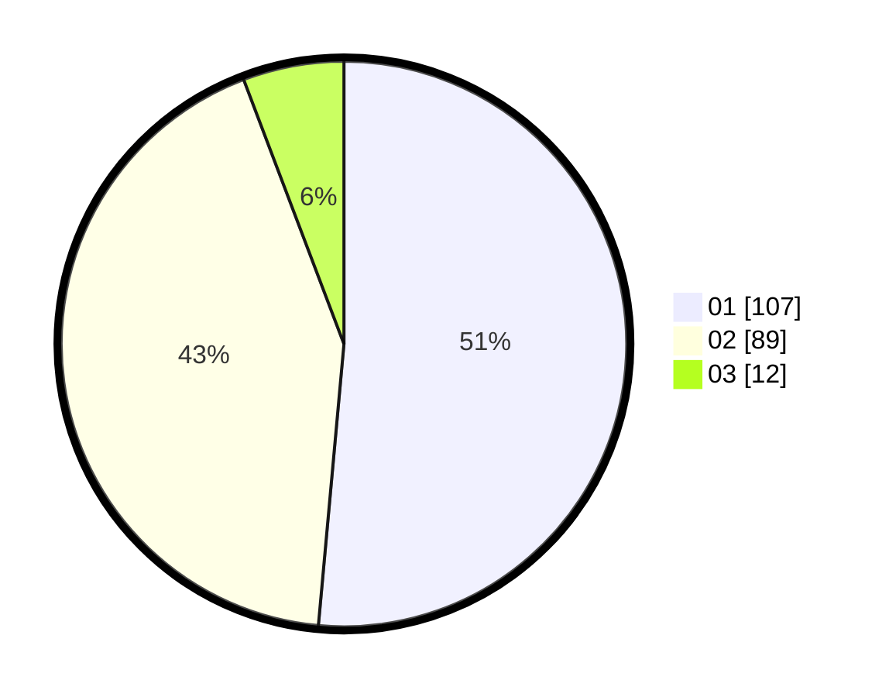

# Hasil

Hasil perolehan suara paslon dapat dilihat pada file paslon-01.txt, paslon-02.txt, dan paslon-03.txt.

Jika tidak ada, artinya data tersebut belum ada pada SIREKAP.

## Perolehan Suara

 * Paslon 01: **107**.
 * Paslon 02: **89**.
 * Paslon 03: **12**.

## Foto C Plano

https://sirekap-obj-formc.kpu.go.id/b510/pemilu/ppwp/31/75/01/10/01/3175011001079-20240215-215909--42320cad-a1ef-40a6-9326-a3b1330c5296.jpg

https://sirekap-obj-formc.kpu.go.id/b510/pemilu/ppwp/31/75/01/10/01/3175011001079-20240215-215911--5e02353d-faad-4b64-8281-b20a4cccfdfe.jpg

https://sirekap-obj-formc.kpu.go.id/b510/pemilu/ppwp/31/75/01/10/01/3175011001079-20240215-215910--52f2eca9-2ea8-460a-a65b-dc5e9028443f.jpg

## DATA PEMILIH TETAP

Jumlah pemilih dalam DPT: **259**.
 * L: **127**.
 * P: **132**.

## DATA PENGGUNA HAK PILIH

Jumlah pengguna hak pilih dalam DPT: **210**.
 * L: **98**.
 * P: **112**.

Jumlah pengguna hak pilih dalam DPTb: **1**.
 * L: **0**.
 * P: **1**.

Jumlah pengguna hak pilih dalam DPK: **0**.
 * L: **0**.
 * P: **0**.

Jumlah pengguna hak pilih: **211**.
 * L: **98**.
 * P: **113**.

## JUMLAH SUARA SAH DAN TIDAK SAH

JUMLAH SELURUH SUARA SAH: **208**.

JUMLAH SUARA TIDAK SAH: **5**.

JUMLAH SELURUH SUARA SAH DAN SUARA TIDAK SAH: **213**.
