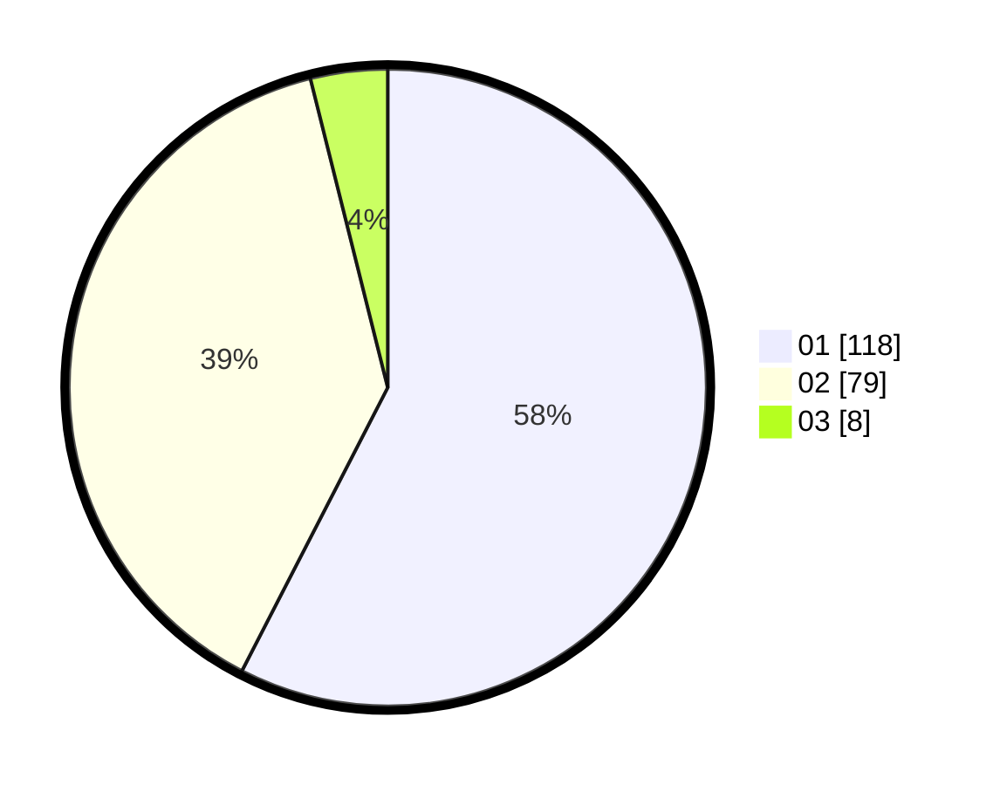

# Hasil

Hasil perolehan suara paslon dapat dilihat pada file paslon-01.txt, paslon-02.txt, dan paslon-03.txt.

Jika tidak ada, artinya data tersebut belum ada pada SIREKAP.

## Perolehan Suara

 * Paslon 01: **118**.
 * Paslon 02: **79**.
 * Paslon 03: **8**.

## Foto C Plano

https://sirekap-obj-formc.kpu.go.id/5906/pemilu/ppwp/31/75/01/10/01/3175011001080-20240215-001609--84cf3e03-7e27-4616-8bfb-4d440d545d1e.jpg

https://sirekap-obj-formc.kpu.go.id/5906/pemilu/ppwp/31/75/01/10/01/3175011001080-20240214-201010--7664a6e1-dc00-4e6c-bfdb-66fd9d0e0d0a.jpg

https://sirekap-obj-formc.kpu.go.id/5906/pemilu/ppwp/31/75/01/10/01/3175011001080-20240214-235529--a9990b29-1da9-4caf-bbfb-5dd0983c4e08.jpg
