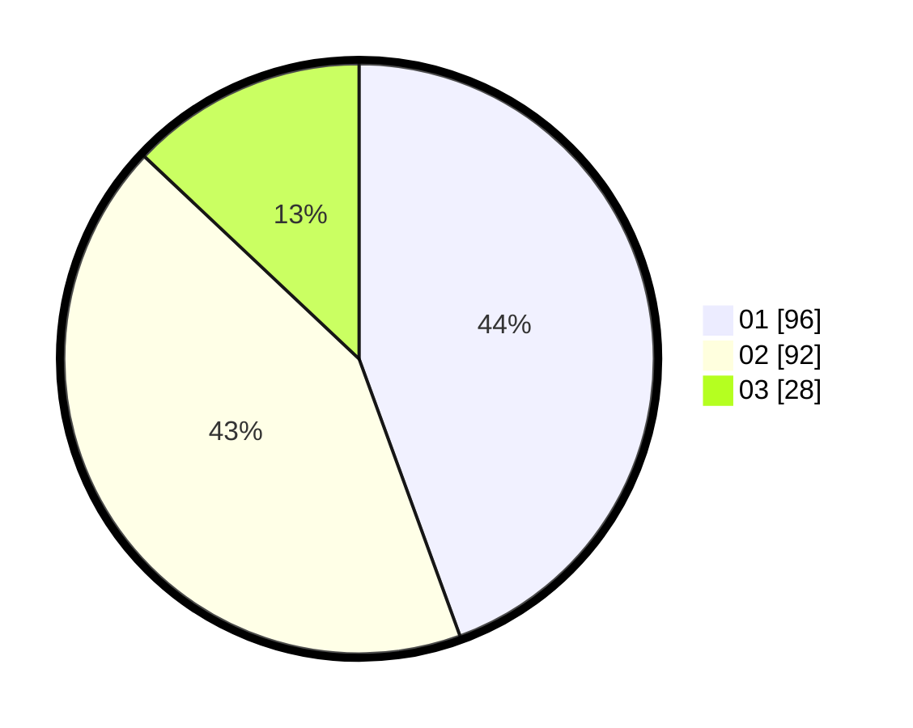

# Hasil

Hasil perolehan suara paslon dapat dilihat pada file paslon-01.txt, paslon-02.txt, dan paslon-03.txt.

Jika tidak ada, artinya data tersebut belum ada pada SIREKAP.

## Perolehan Suara

 * Paslon 01: **96**.
 * Paslon 02: **92**.
 * Paslon 03: **28**.

## Foto C Plano

https://sirekap-obj-formc.kpu.go.id/7a1f/pemilu/ppwp/31/75/01/10/01/3175011001088-20240216-142419--80852166-2aa5-4ca0-bbbe-6eec4152f286.jpg

https://sirekap-obj-formc.kpu.go.id/7a1f/pemilu/ppwp/31/75/01/10/01/3175011001088-20240216-142421--cd76eee7-0556-441e-a6e4-4294c9a536e1.jpg

https://sirekap-obj-formc.kpu.go.id/7a1f/pemilu/ppwp/31/75/01/10/01/3175011001088-20240216-142420--d468f5c5-57b1-4b5c-abe7-b59a070c44ba.jpg

## DATA PEMILIH TETAP

Jumlah pemilih dalam DPT: **261**.
 * L: **135**.
 * P: **126**.

## DATA PENGGUNA HAK PILIH

Jumlah pengguna hak pilih dalam DPT: **215**.
 * L: **109**.
 * P: **106**.

Jumlah pengguna hak pilih dalam DPTb: **6**.
 * L: **3**.
 * P: **3**.

Jumlah pengguna hak pilih dalam DPK: **1**.
 * L: **0**.
 * P: **1**.

Jumlah pengguna hak pilih: **222**.
 * L: **112**.
 * P: **110**.

## JUMLAH SUARA SAH DAN TIDAK SAH

JUMLAH SELURUH SUARA SAH: **216**.

JUMLAH SUARA TIDAK SAH: **6**.

JUMLAH SELURUH SUARA SAH DAN SUARA TIDAK SAH: **222**.
