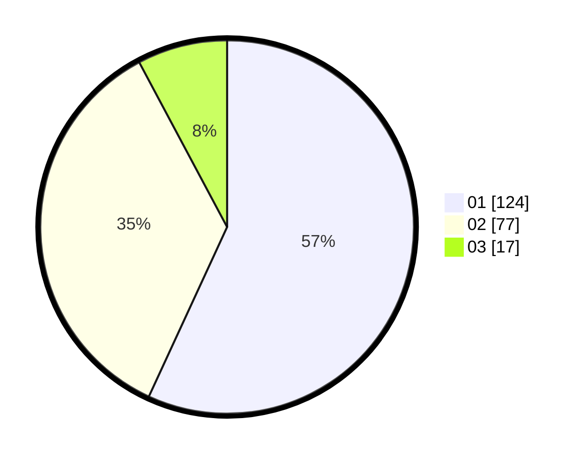

# Hasil

Hasil perolehan suara paslon dapat dilihat pada file paslon-01.txt, paslon-02.txt, dan paslon-03.txt.

Jika tidak ada, artinya data tersebut belum ada pada SIREKAP.

## Perolehan Suara

 * Paslon 01: **124**.
 * Paslon 02: **77**.
 * Paslon 03: **17**.

## Foto C Plano

https://sirekap-obj-formc.kpu.go.id/e129/pemilu/ppwp/31/75/01/10/01/3175011001097-20240216-233252--095f5dc7-6cfd-43dd-8a14-9ab3518bbc6f.jpg

https://sirekap-obj-formc.kpu.go.id/e129/pemilu/ppwp/31/75/01/10/01/3175011001097-20240216-235517--d4fa683e-e08b-4770-ab25-ea21c312c0a8.jpg

https://sirekap-obj-formc.kpu.go.id/e129/pemilu/ppwp/31/75/01/10/01/3175011001097-20240216-233358--89694bae-8746-4a9e-ab79-19c15be8545a.jpg
