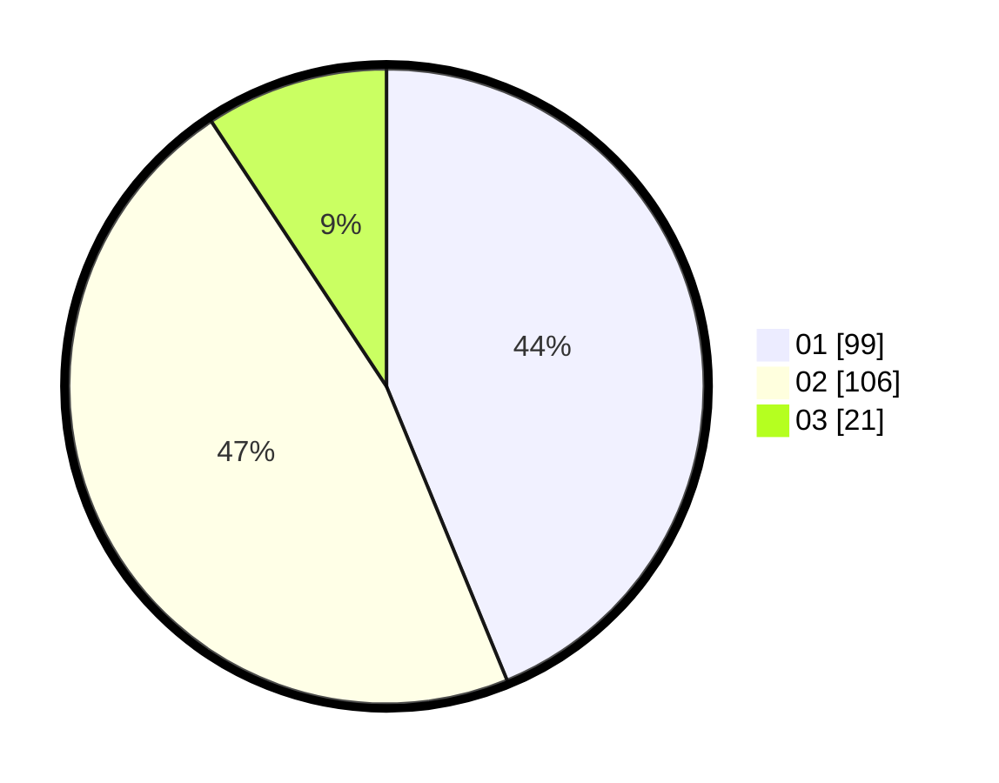

# Hasil

Hasil perolehan suara paslon dapat dilihat pada file paslon-01.txt, paslon-02.txt, dan paslon-03.txt.

Jika tidak ada, artinya data tersebut belum ada pada SIREKAP.

## Perolehan Suara

 * Paslon 01: **99**.
 * Paslon 02: **106**.
 * Paslon 03: **21**.

## Foto C Plano

https://sirekap-obj-formc.kpu.go.id/f7b1/pemilu/ppwp/31/75/01/10/01/3175011001099-20240214-160155--b8455878-0696-4686-a331-8e420b2a9466.jpg

https://sirekap-obj-formc.kpu.go.id/f7b1/pemilu/ppwp/31/75/01/10/01/3175011001099-20240214-194757--d7d1f938-0959-4535-a631-b3d1550ea47d.jpg

https://sirekap-obj-formc.kpu.go.id/f7b1/pemilu/ppwp/31/75/01/10/01/3175011001099-20240214-190225--c4d1b7a1-ef0d-4dd4-8388-188ea58229c2.jpg

## DATA PEMILIH TETAP

Jumlah pemilih dalam DPT: **280**.
 * L: **138**.
 * P: **142**.

## DATA PENGGUNA HAK PILIH

Jumlah pengguna hak pilih dalam DPT: **227**.
 * L: **104**.
 * P: **123**.

Jumlah pengguna hak pilih dalam DPTb: **1**.
 * L: **0**.
 * P: **1**.

Jumlah pengguna hak pilih dalam DPK: **1**.
 * L: **1**.
 * P: **0**.

Jumlah pengguna hak pilih: **229**.
 * L: **105**.
 * P: **124**.

## JUMLAH SUARA SAH DAN TIDAK SAH

JUMLAH SELURUH SUARA SAH: **226**.

JUMLAH SUARA TIDAK SAH: **3**.

JUMLAH SELURUH SUARA SAH DAN SUARA TIDAK SAH: **229**.
