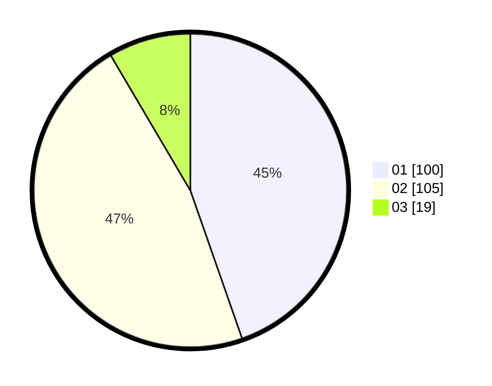

# Hasil

Hasil perolehan suara paslon dapat dilihat pada file paslon-01.txt, paslon-02.txt, dan paslon-03.txt.

Jika tidak ada, artinya data tersebut belum ada pada SIREKAP.

## Perolehan Suara

 * Paslon 01: **100**.
 * Paslon 02: **105**.
 * Paslon 03: **19**.

## Foto C Plano

https://sirekap-obj-formc.kpu.go.id/d1ef/pemilu/ppwp/31/75/01/10/01/3175011001103-20240214-185853--2bccc520-1e73-474f-a359-4a814fa1ed74.jpg

https://sirekap-obj-formc.kpu.go.id/d1ef/pemilu/ppwp/31/75/01/10/01/3175011001103-20240214-185930--dd5d06eb-61a9-4acc-9d52-993c3db3d754.jpg

https://sirekap-obj-formc.kpu.go.id/d1ef/pemilu/ppwp/31/75/01/10/01/3175011001103-20240214-190011--52656396-4018-4506-8d85-96be0fee9b52.jpg

## DATA PEMILIH TETAP

Jumlah pemilih dalam DPT: **280**.
 * L: **135**.
 * P: **145**.

## DATA PENGGUNA HAK PILIH

Jumlah pengguna hak pilih dalam DPT: **231**.
 * L: **109**.
 * P: **122**.

Jumlah pengguna hak pilih dalam DPTb: **0**.
 * L: **0**.
 * P: **0**.

Jumlah pengguna hak pilih dalam DPK: **0**.
 * L: **0**.
 * P: **0**.

Jumlah pengguna hak pilih: **231**.
 * L: **109**.
 * P: **122**.

## JUMLAH SUARA SAH DAN TIDAK SAH

JUMLAH SELURUH SUARA SAH: **224**.

JUMLAH SUARA TIDAK SAH: **7**.

JUMLAH SELURUH SUARA SAH DAN SUARA TIDAK SAH: **231**.
