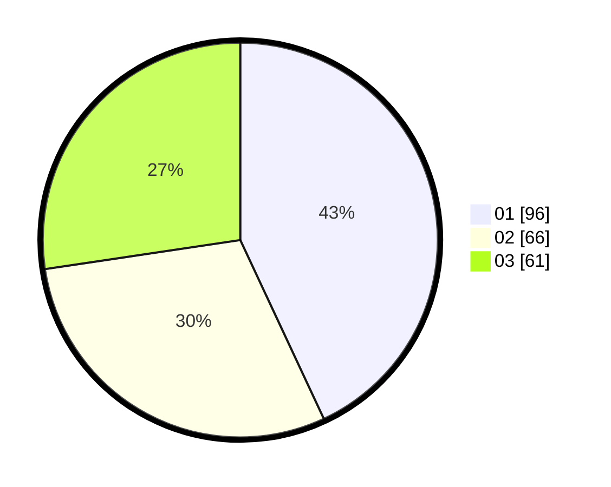

# Hasil

Hasil perolehan suara paslon dapat dilihat pada file paslon-01.txt, paslon-02.txt, dan paslon-03.txt.

Jika tidak ada, artinya data tersebut belum ada pada SIREKAP.

## Perolehan Suara

 * Paslon 01: **96**.
 * Paslon 02: **66**.
 * Paslon 03: **61**.

## Foto C Plano

https://sirekap-obj-formc.kpu.go.id/56e7/pemilu/ppwp/31/75/01/10/01/3175011001106-20240214-225612--7f116251-07da-4bfd-9ebd-ef56d255bc6f.jpg

https://sirekap-obj-formc.kpu.go.id/56e7/pemilu/ppwp/31/75/01/10/01/3175011001106-20240214-225651--5e87eefe-dc20-48e9-9e73-70dadee5448d.jpg

https://sirekap-obj-formc.kpu.go.id/56e7/pemilu/ppwp/31/75/01/10/01/3175011001106-20240214-225935--82adcf07-1a11-4c0b-8d1b-cab323f31371.jpg

## DATA PEMILIH TETAP

Jumlah pemilih dalam DPT: **273**.
 * L: **197**.
 * P: **146**.

## DATA PENGGUNA HAK PILIH

Jumlah pengguna hak pilih dalam DPT: **206**.
 * L: **92**.
 * P: **114**.

Jumlah pengguna hak pilih dalam DPTb: **17**.
 * L: **6**.
 * P: **11**.

Jumlah pengguna hak pilih dalam DPK: **6**.
 * L: **2**.
 * P: **4**.

Jumlah pengguna hak pilih: **229**.
 * L: **100**.
 * P: **129**.

## JUMLAH SUARA SAH DAN TIDAK SAH

JUMLAH SELURUH SUARA SAH: **223**.

JUMLAH SUARA TIDAK SAH: **6**.

JUMLAH SELURUH SUARA SAH DAN SUARA TIDAK SAH: **229**.
