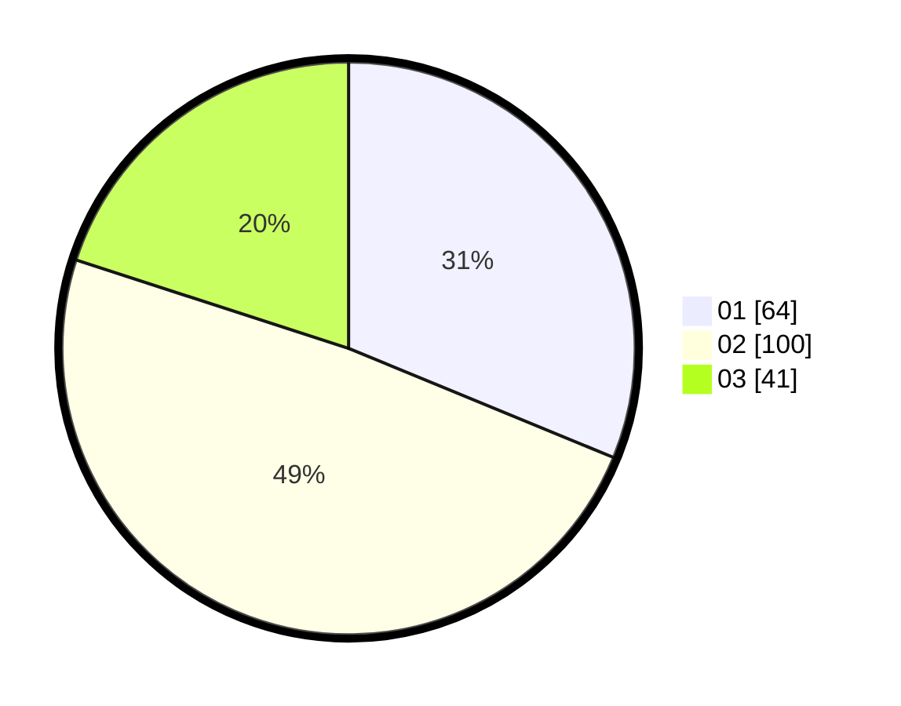

# Hasil

Hasil perolehan suara paslon dapat dilihat pada file paslon-01.txt, paslon-02.txt, dan paslon-03.txt.

Jika tidak ada, artinya data tersebut belum ada pada SIREKAP.

## Perolehan Suara

 * Paslon 01: **64**.
 * Paslon 02: **100**.
 * Paslon 03: **41**.

## Foto C Plano

https://sirekap-obj-formc.kpu.go.id/d65c/pemilu/ppwp/31/75/01/10/02/3175011002002-20240216-180842--6db6b514-e14a-40ef-8df8-95db7ab3dbaa.jpg

https://sirekap-obj-formc.kpu.go.id/d65c/pemilu/ppwp/31/75/01/10/02/3175011002002-20240216-180843--0a732e63-6e37-47ef-aeec-3edf7f80c67e.jpg

https://sirekap-obj-formc.kpu.go.id/d65c/pemilu/ppwp/31/75/01/10/02/3175011002002-20240216-180843--da6204c9-712a-4b52-9392-2f59edbf6185.jpg

## DATA PEMILIH TETAP

Jumlah pemilih dalam DPT: **253**.
 * L: **118**.
 * P: **135**.

## DATA PENGGUNA HAK PILIH

Jumlah pengguna hak pilih dalam DPT: **206**.
 * L: **93**.
 * P: **113**.

Jumlah pengguna hak pilih dalam DPTb: **3**.
 * L: **3**.
 * P: **0**.

Jumlah pengguna hak pilih dalam DPK: **1**.
 * L: **1**.
 * P: **0**.

Jumlah pengguna hak pilih: **210**.
 * L: **97**.
 * P: **113**.

## JUMLAH SUARA SAH DAN TIDAK SAH

JUMLAH SELURUH SUARA SAH: **205**.

JUMLAH SUARA TIDAK SAH: **5**.

JUMLAH SELURUH SUARA SAH DAN SUARA TIDAK SAH: **210**.
