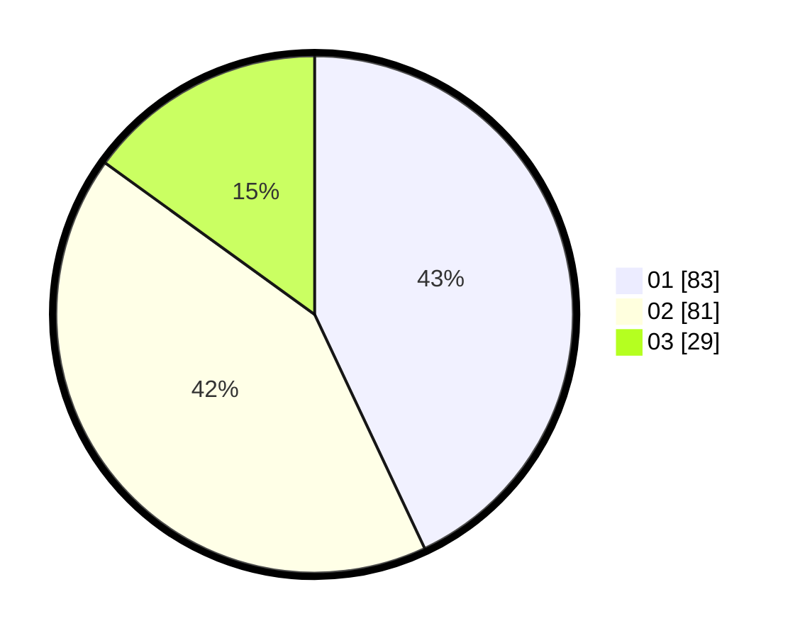

# Hasil

Hasil perolehan suara paslon dapat dilihat pada file paslon-01.txt, paslon-02.txt, dan paslon-03.txt.

Jika tidak ada, artinya data tersebut belum ada pada SIREKAP.

## Perolehan Suara

 * Paslon 01: **83**.
 * Paslon 02: **81**.
 * Paslon 03: **29**.

## Foto C Plano

https://sirekap-obj-formc.kpu.go.id/c56b/pemilu/ppwp/31/75/01/10/02/3175011002003-20240214-212737--66b54dba-ab42-418b-a7e3-fb7f1c8d60bb.jpg

https://sirekap-obj-formc.kpu.go.id/c56b/pemilu/ppwp/31/75/01/10/02/3175011002003-20240214-212842--dd0c27c7-9aa1-4a64-8b27-f1397c8a8c65.jpg

https://sirekap-obj-formc.kpu.go.id/c56b/pemilu/ppwp/31/75/01/10/02/3175011002003-20240214-212943--47112698-39c8-4466-b8db-53ca5598eae6.jpg
