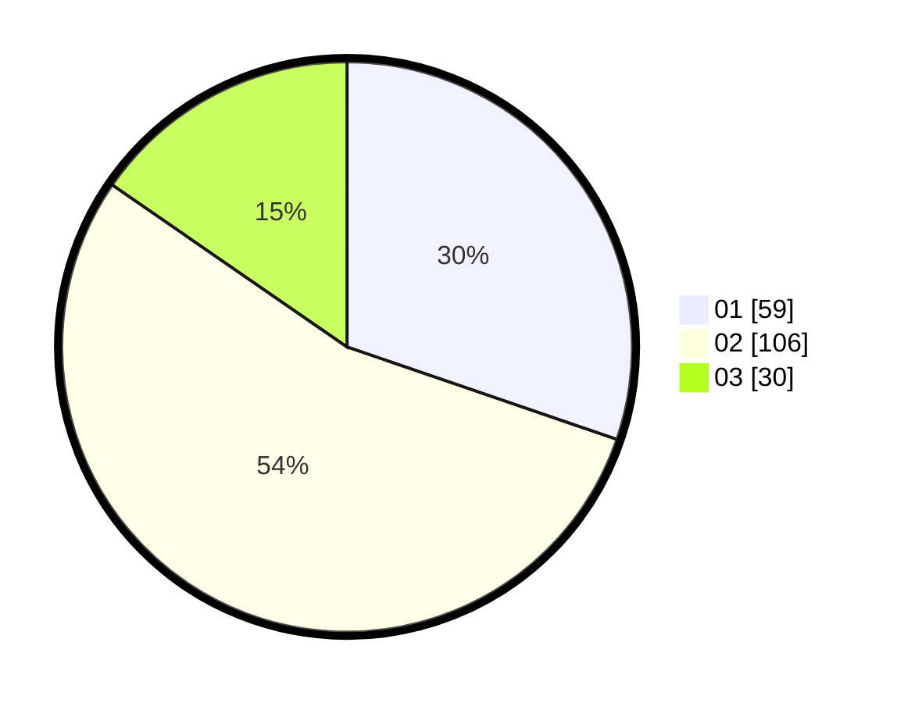

# Hasil

Hasil perolehan suara paslon dapat dilihat pada file paslon-01.txt, paslon-02.txt, dan paslon-03.txt.

Jika tidak ada, artinya data tersebut belum ada pada SIREKAP.

## Perolehan Suara

 * Paslon 01: **59**.
 * Paslon 02: **106**.
 * Paslon 03: **30**.

## Foto C Plano

https://sirekap-obj-formc.kpu.go.id/3569/pemilu/ppwp/31/75/01/10/02/3175011002007-20240215-011337--66b366f4-de88-44c5-bab3-368289d83b9e.jpg

https://sirekap-obj-formc.kpu.go.id/3569/pemilu/ppwp/31/75/01/10/02/3175011002007-20240215-011455--fb773122-b1ae-432e-a781-c1b8493b4a6b.jpg

https://sirekap-obj-formc.kpu.go.id/3569/pemilu/ppwp/31/75/01/10/02/3175011002007-20240215-011606--09b952f3-0623-4733-9923-f0c8e5ffd411.jpg
