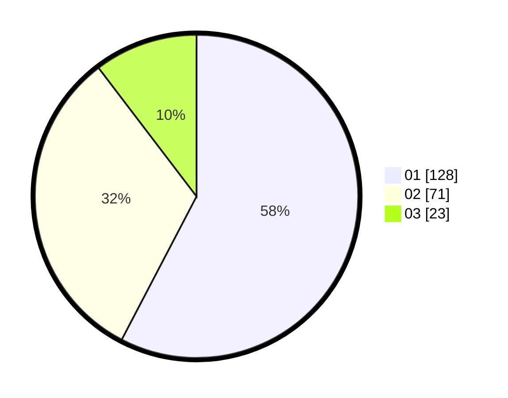

# Hasil

Hasil perolehan suara paslon dapat dilihat pada file paslon-01.txt, paslon-02.txt, dan paslon-03.txt.

Jika tidak ada, artinya data tersebut belum ada pada SIREKAP.

## Perolehan Suara

 * Paslon 01: **128**.
 * Paslon 02: **71**.
 * Paslon 03: **23**.

## Foto C Plano

https://sirekap-obj-formc.kpu.go.id/f2f1/pemilu/ppwp/31/75/01/10/02/3175011002010-20240215-210239--a1a5329e-2936-4d5f-bfdb-4a4bd55b85cc.jpg

https://sirekap-obj-formc.kpu.go.id/f2f1/pemilu/ppwp/31/75/01/10/02/3175011002010-20240215-210241--8a6d698e-8c25-4694-92ef-1a4ed2550ab4.jpg

https://sirekap-obj-formc.kpu.go.id/f2f1/pemilu/ppwp/31/75/01/10/02/3175011002010-20240215-210240--bb0935e2-b7e6-48fc-a34c-28ad6627d8ad.jpg

## DATA PEMILIH TETAP

Jumlah pemilih dalam DPT: **284**.
 * L: **145**.
 * P: **139**.

## DATA PENGGUNA HAK PILIH

Jumlah pengguna hak pilih dalam DPT: **221**.
 * L: **118**.
 * P: **103**.

Jumlah pengguna hak pilih dalam DPTb: **1**.
 * L: **1**.
 * P: **0**.

Jumlah pengguna hak pilih dalam DPK: **4**.
 * L: **1**.
 * P: **3**.

Jumlah pengguna hak pilih: **226**.
 * L: **120**.
 * P: **106**.

## JUMLAH SUARA SAH DAN TIDAK SAH

JUMLAH SELURUH SUARA SAH: **222**.

JUMLAH SUARA TIDAK SAH: **4**.

JUMLAH SELURUH SUARA SAH DAN SUARA TIDAK SAH: **226**.
