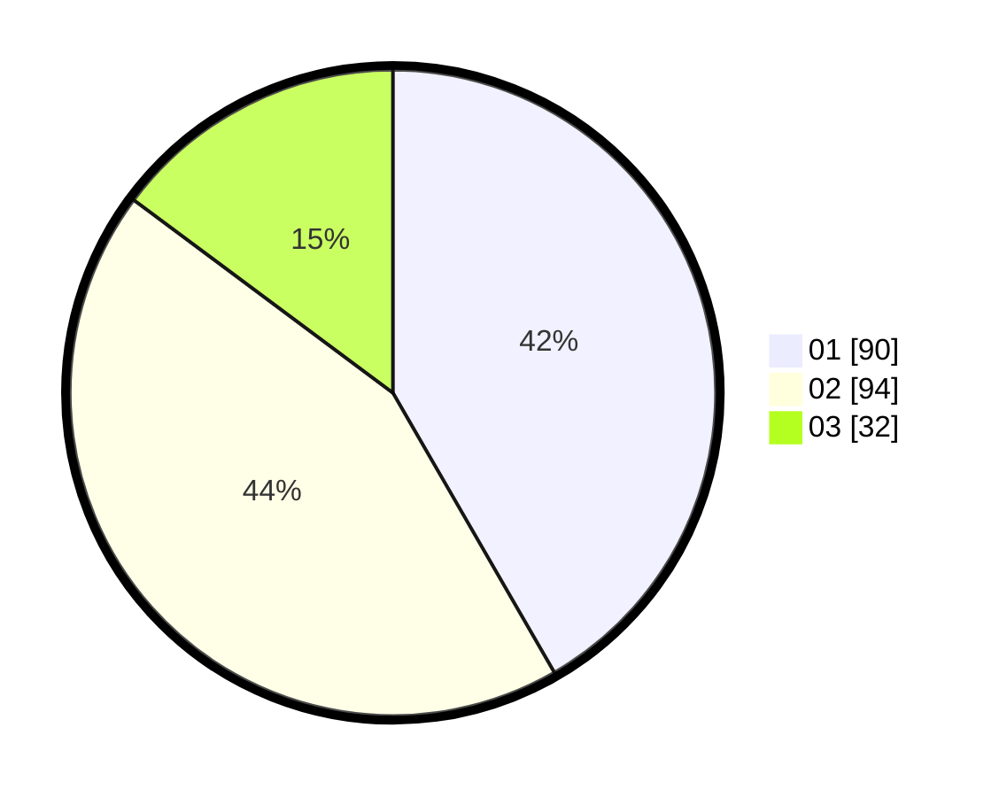

# Hasil

Hasil perolehan suara paslon dapat dilihat pada file paslon-01.txt, paslon-02.txt, dan paslon-03.txt.

Jika tidak ada, artinya data tersebut belum ada pada SIREKAP.

## Perolehan Suara

 * Paslon 01: **90**.
 * Paslon 02: **94**.
 * Paslon 03: **32**.

## Foto C Plano

https://sirekap-obj-formc.kpu.go.id/2886/pemilu/ppwp/31/75/01/10/02/3175011002011-20240214-155208--8efca874-a523-4a63-9f57-bd3ab36e8e7f.jpg

https://sirekap-obj-formc.kpu.go.id/2886/pemilu/ppwp/31/75/01/10/02/3175011002011-20240215-184917--59dd570a-f891-439c-956a-a19e2588ec37.jpg

https://sirekap-obj-formc.kpu.go.id/2886/pemilu/ppwp/31/75/01/10/02/3175011002011-20240215-185048--e6beb400-451d-4170-8f98-bfa29e4905e6.jpg

## DATA PEMILIH TETAP

Jumlah pemilih dalam DPT: **280**.
 * L: **137**.
 * P: **143**.

## DATA PENGGUNA HAK PILIH

Jumlah pengguna hak pilih dalam DPT: **268**.
 * L: **100**.
 * P: **118**.

Jumlah pengguna hak pilih dalam DPTb: **5**.
 * L: **0**.
 * P: **1**.

Jumlah pengguna hak pilih dalam DPK: **1**.
 * L: **0**.
 * P: **1**.

Jumlah pengguna hak pilih: **220**.
 * L: **100**.
 * P: **120**.

## JUMLAH SUARA SAH DAN TIDAK SAH

JUMLAH SELURUH SUARA SAH: **216**.

JUMLAH SUARA TIDAK SAH: **4**.

JUMLAH SELURUH SUARA SAH DAN SUARA TIDAK SAH: **220**.
