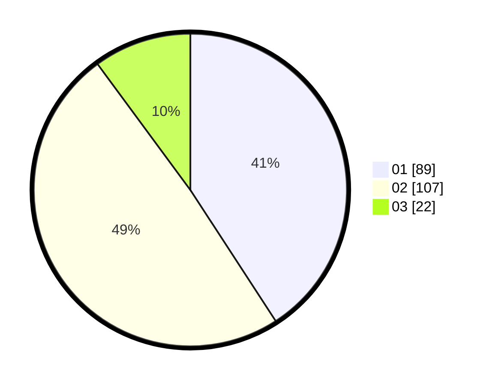

# Hasil

Hasil perolehan suara paslon dapat dilihat pada file paslon-01.txt, paslon-02.txt, dan paslon-03.txt.

Jika tidak ada, artinya data tersebut belum ada pada SIREKAP.

## Perolehan Suara

 * Paslon 01: **89**.
 * Paslon 02: **107**.
 * Paslon 03: **22**.

## Foto C Plano

https://sirekap-obj-formc.kpu.go.id/6e18/pemilu/ppwp/31/75/01/10/02/3175011002013-20240214-233600--71667fb1-df41-4cf3-b4dc-1afcf2d5e745.jpg

https://sirekap-obj-formc.kpu.go.id/6e18/pemilu/ppwp/31/75/01/10/02/3175011002013-20240214-233552--34fd1d15-282d-4c25-b03e-c3ab5b200e45.jpg

https://sirekap-obj-formc.kpu.go.id/6e18/pemilu/ppwp/31/75/01/10/02/3175011002013-20240214-233643--28ec457a-cb73-4bf4-bdfc-8922abc057a0.jpg
