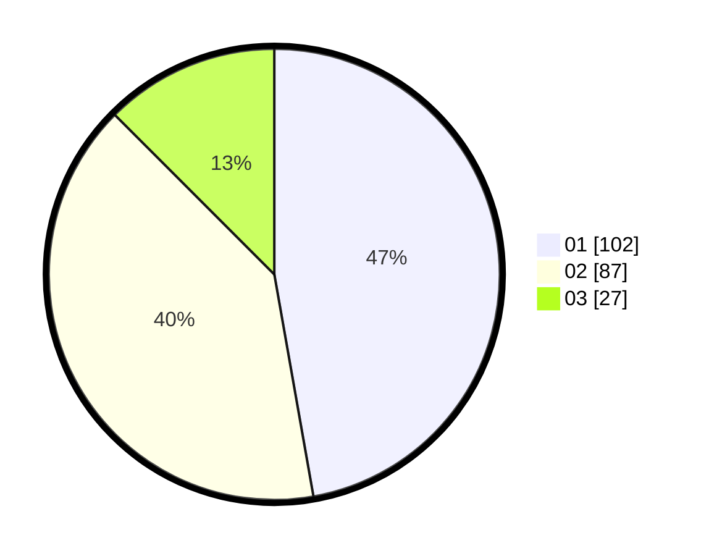

# Hasil

Hasil perolehan suara paslon dapat dilihat pada file paslon-01.txt, paslon-02.txt, dan paslon-03.txt.

Jika tidak ada, artinya data tersebut belum ada pada SIREKAP.

## Perolehan Suara

 * Paslon 01: **102**.
 * Paslon 02: **87**.
 * Paslon 03: **27**.

## Foto C Plano

https://sirekap-obj-formc.kpu.go.id/c9ec/pemilu/ppwp/31/75/01/10/02/3175011002017-20240214-194927--6141989e-a640-416a-a809-82cb8eedd972.jpg

https://sirekap-obj-formc.kpu.go.id/c9ec/pemilu/ppwp/31/75/01/10/02/3175011002017-20240214-192855--658a14e6-d496-4e6e-b5da-4f97c49f5710.jpg

https://sirekap-obj-formc.kpu.go.id/c9ec/pemilu/ppwp/31/75/01/10/02/3175011002017-20240214-192935--cac3a3f6-ed2e-4b43-acd5-5c4f088f9540.jpg

## DATA PEMILIH TETAP

Jumlah pemilih dalam DPT: **278**.
 * L: **141**.
 * P: **137**.

## DATA PENGGUNA HAK PILIH

Jumlah pengguna hak pilih dalam DPT: **216**.
 * L: **108**.
 * P: **108**.

Jumlah pengguna hak pilih dalam DPTb: **0**.
 * L: **0**.
 * P: **0**.

Jumlah pengguna hak pilih dalam DPK: **4**.
 * L: **2**.
 * P: **2**.

Jumlah pengguna hak pilih: **216**.
 * L: **808**.
 * P: **8**.

## JUMLAH SUARA SAH DAN TIDAK SAH

JUMLAH SELURUH SUARA SAH: **216**.

JUMLAH SUARA TIDAK SAH: **0**.

JUMLAH SELURUH SUARA SAH DAN SUARA TIDAK SAH: **216**.
