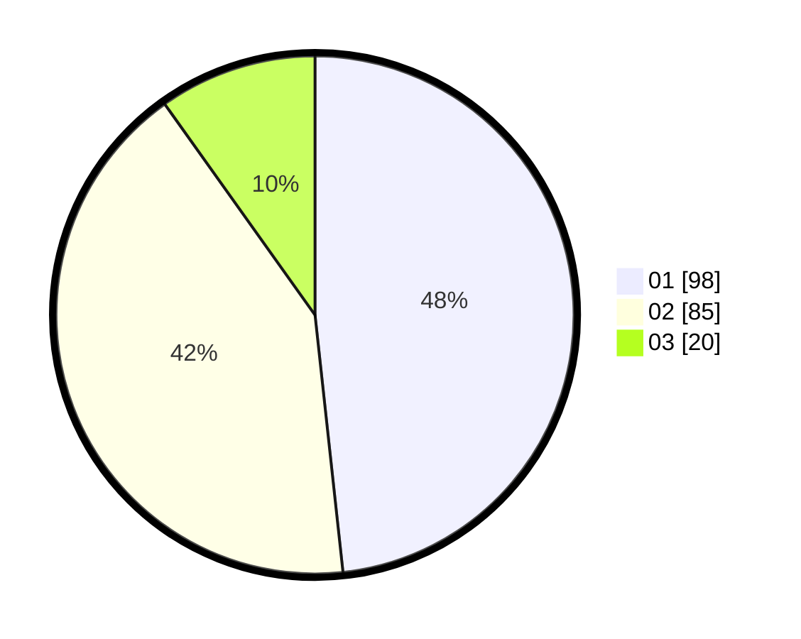

# Hasil

Hasil perolehan suara paslon dapat dilihat pada file paslon-01.txt, paslon-02.txt, dan paslon-03.txt.

Jika tidak ada, artinya data tersebut belum ada pada SIREKAP.

## Perolehan Suara

 * Paslon 01: **98**.
 * Paslon 02: **85**.
 * Paslon 03: **20**.

## Foto C Plano

https://sirekap-obj-formc.kpu.go.id/4fcc/pemilu/ppwp/31/75/01/10/02/3175011002019-20240215-021202--d1ed8757-e1b4-458c-8fe9-2c7ab47c55cd.jpg

https://sirekap-obj-formc.kpu.go.id/4fcc/pemilu/ppwp/31/75/01/10/02/3175011002019-20240215-021315--f371ae1d-881d-4dbe-bb06-6537b093bd49.jpg

https://sirekap-obj-formc.kpu.go.id/4fcc/pemilu/ppwp/31/75/01/10/02/3175011002019-20240215-021549--40772261-05b8-4edc-bd66-83dab8ce00eb.jpg
