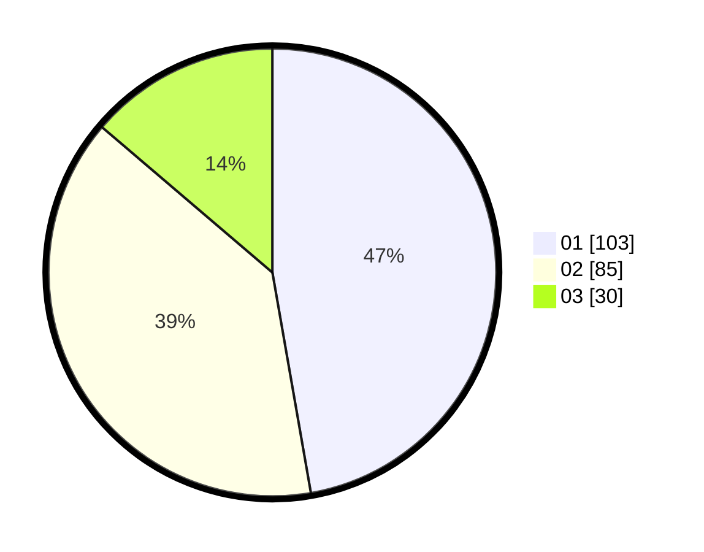

# Hasil

Hasil perolehan suara paslon dapat dilihat pada file paslon-01.txt, paslon-02.txt, dan paslon-03.txt.

Jika tidak ada, artinya data tersebut belum ada pada SIREKAP.

## Perolehan Suara

 * Paslon 01: **103**.
 * Paslon 02: **85**.
 * Paslon 03: **30**.

## Foto C Plano

https://sirekap-obj-formc.kpu.go.id/54c2/pemilu/ppwp/31/75/01/10/02/3175011002020-20240215-010617--79bd39e8-cf38-4645-a5dd-ff5c7dc1226e.jpg

https://sirekap-obj-formc.kpu.go.id/54c2/pemilu/ppwp/31/75/01/10/02/3175011002020-20240215-015732--8199d857-e8cb-495e-8e82-cad6c7d8c182.jpg

https://sirekap-obj-formc.kpu.go.id/54c2/pemilu/ppwp/31/75/01/10/02/3175011002020-20240215-015109--0c4e03e2-666a-4fdc-b4fe-d34391886166.jpg

## DATA PEMILIH TETAP

Jumlah pemilih dalam DPT: **275**.
 * L: **131**.
 * P: **144**.

## DATA PENGGUNA HAK PILIH

Jumlah pengguna hak pilih dalam DPT: **218**.
 * L: **101**.
 * P: **117**.

Jumlah pengguna hak pilih dalam DPTb: **2**.
 * L: **1**.
 * P: **1**.

Jumlah pengguna hak pilih dalam DPK: **2**.
 * L: **0**.
 * P: **2**.

Jumlah pengguna hak pilih: **222**.
 * L: **102**.
 * P: **120**.

## JUMLAH SUARA SAH DAN TIDAK SAH

JUMLAH SELURUH SUARA SAH: **218**.

JUMLAH SUARA TIDAK SAH: **4**.

JUMLAH SELURUH SUARA SAH DAN SUARA TIDAK SAH: **222**.
