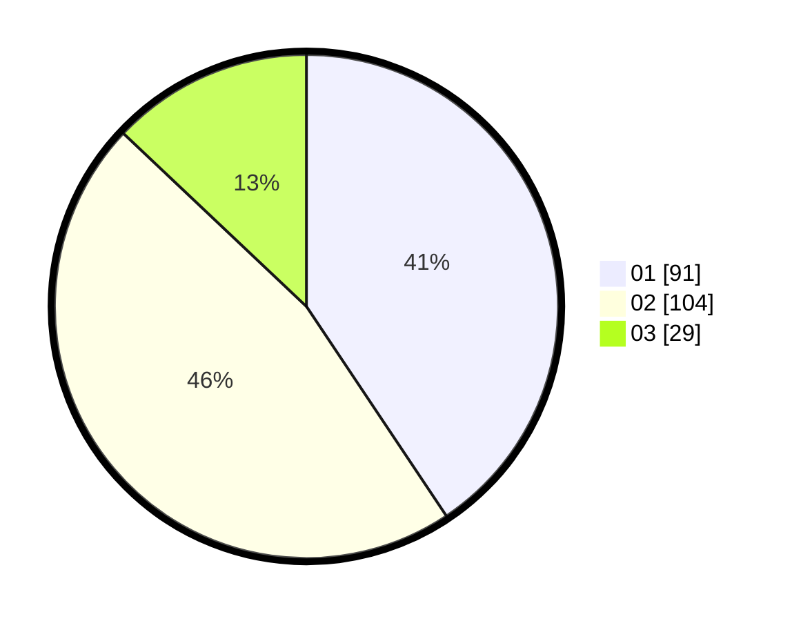

# Hasil

Hasil perolehan suara paslon dapat dilihat pada file paslon-01.txt, paslon-02.txt, dan paslon-03.txt.

Jika tidak ada, artinya data tersebut belum ada pada SIREKAP.

## Perolehan Suara

 * Paslon 01: **91**.
 * Paslon 02: **104**.
 * Paslon 03: **29**.

## Foto C Plano

https://sirekap-obj-formc.kpu.go.id/3e7e/pemilu/ppwp/31/75/01/10/02/3175011002023-20240215-205836--2a008c49-2f68-4cc4-ae43-331ea4401f39.jpg

https://sirekap-obj-formc.kpu.go.id/3e7e/pemilu/ppwp/31/75/01/10/02/3175011002023-20240215-205839--4c104504-0a3c-4c3f-a047-646074724cbb.jpg

https://sirekap-obj-formc.kpu.go.id/3e7e/pemilu/ppwp/31/75/01/10/02/3175011002023-20240215-205837--015948a1-a537-469f-bcc1-13b5926f1b90.jpg

## DATA PEMILIH TETAP

Jumlah pemilih dalam DPT: **279**.
 * L: **142**.
 * P: **137**.

## DATA PENGGUNA HAK PILIH

Jumlah pengguna hak pilih dalam DPT: **219**.
 * L: **106**.
 * P: **113**.

Jumlah pengguna hak pilih dalam DPTb: **8**.
 * L: **5**.
 * P: **3**.

Jumlah pengguna hak pilih dalam DPK: **0**.
 * L: **0**.
 * P: **0**.

Jumlah pengguna hak pilih: **227**.
 * L: **111**.
 * P: **116**.

## JUMLAH SUARA SAH DAN TIDAK SAH

JUMLAH SELURUH SUARA SAH: **224**.

JUMLAH SUARA TIDAK SAH: **3**.

JUMLAH SELURUH SUARA SAH DAN SUARA TIDAK SAH: **227**.
