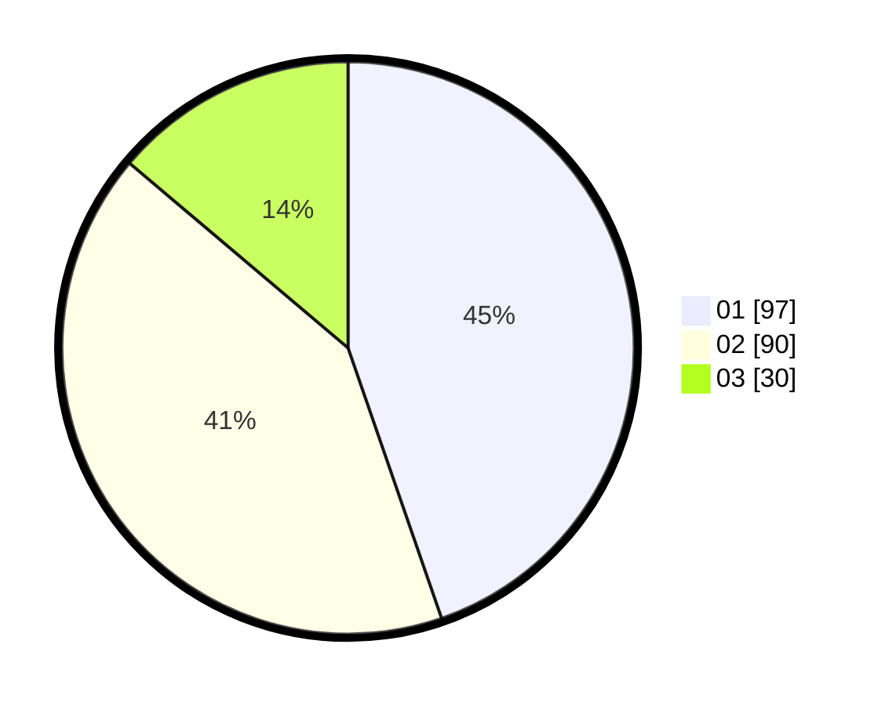

# Hasil

Hasil perolehan suara paslon dapat dilihat pada file paslon-01.txt, paslon-02.txt, dan paslon-03.txt.

Jika tidak ada, artinya data tersebut belum ada pada SIREKAP.

## Perolehan Suara

 * Paslon 01: **97**.
 * Paslon 02: **90**.
 * Paslon 03: **30**.

## Foto C Plano

https://sirekap-obj-formc.kpu.go.id/878e/pemilu/ppwp/31/75/01/10/02/3175011002025-20240214-193845--52c79ccd-e4d7-413a-86c6-b0e980f725ef.jpg

https://sirekap-obj-formc.kpu.go.id/878e/pemilu/ppwp/31/75/01/10/02/3175011002025-20240214-220028--8ec36d64-0191-4d8a-8926-064a9bb026e7.jpg

https://sirekap-obj-formc.kpu.go.id/878e/pemilu/ppwp/31/75/01/10/02/3175011002025-20240214-193458--a4e1ec3f-7f6e-45ce-93df-71aabc1d38df.jpg

## DATA PEMILIH TETAP

Jumlah pemilih dalam DPT: **271**.
 * L: **139**.
 * P: **132**.

## DATA PENGGUNA HAK PILIH

Jumlah pengguna hak pilih dalam DPT: **214**.
 * L: **110**.
 * P: **104**.

Jumlah pengguna hak pilih dalam DPTb: **7**.
 * L: **5**.
 * P: **2**.

Jumlah pengguna hak pilih dalam DPK: **1**.
 * L: **1**.
 * P: **0**.

Jumlah pengguna hak pilih: **222**.
 * L: **116**.
 * P: **106**.

## JUMLAH SUARA SAH DAN TIDAK SAH

JUMLAH SELURUH SUARA SAH: **217**.

JUMLAH SUARA TIDAK SAH: **5**.

JUMLAH SELURUH SUARA SAH DAN SUARA TIDAK SAH: **222**.
