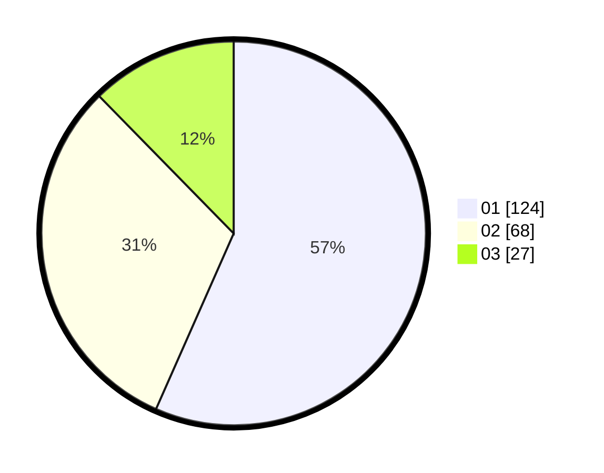

# Hasil

Hasil perolehan suara paslon dapat dilihat pada file paslon-01.txt, paslon-02.txt, dan paslon-03.txt.

Jika tidak ada, artinya data tersebut belum ada pada SIREKAP.

## Perolehan Suara

 * Paslon 01: **124**.
 * Paslon 02: **68**.
 * Paslon 03: **27**.

## Foto C Plano

https://sirekap-obj-formc.kpu.go.id/ba28/pemilu/ppwp/31/75/01/10/02/3175011002026-20240214-232324--3fd7a7fc-6d05-42c1-befc-d31995f613fd.jpg

https://sirekap-obj-formc.kpu.go.id/ba28/pemilu/ppwp/31/75/01/10/02/3175011002026-20240214-201103--4049a058-9432-4d69-b2e6-3dad82dd2abc.jpg

https://sirekap-obj-formc.kpu.go.id/ba28/pemilu/ppwp/31/75/01/10/02/3175011002026-20240214-203253--bc6bfa98-978e-42ec-b665-d3c8be8b0b6e.jpg
