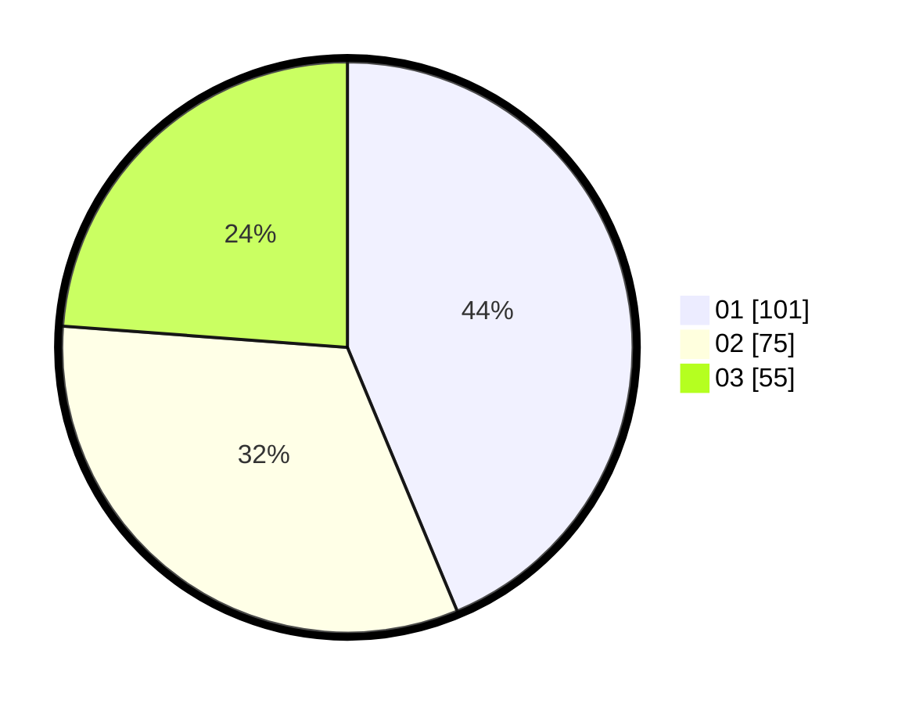

# Hasil

Hasil perolehan suara paslon dapat dilihat pada file paslon-01.txt, paslon-02.txt, dan paslon-03.txt.

Jika tidak ada, artinya data tersebut belum ada pada SIREKAP.

## Perolehan Suara

 * Paslon 01: **101**.
 * Paslon 02: **75**.
 * Paslon 03: **55**.

## Foto C Plano

https://sirekap-obj-formc.kpu.go.id/1d28/pemilu/ppwp/31/75/01/10/02/3175011002029-20240214-190526--3d9c60ad-ef40-418e-b3a7-2428ba9810b5.jpg

https://sirekap-obj-formc.kpu.go.id/1d28/pemilu/ppwp/31/75/01/10/02/3175011002029-20240214-190556--6a1e03e5-ce29-4d54-aab8-e2f83c2dbf70.jpg

https://sirekap-obj-formc.kpu.go.id/1d28/pemilu/ppwp/31/75/01/10/02/3175011002029-20240214-190620--5472de09-8bd5-47f2-a30f-14ebb7e97f67.jpg
