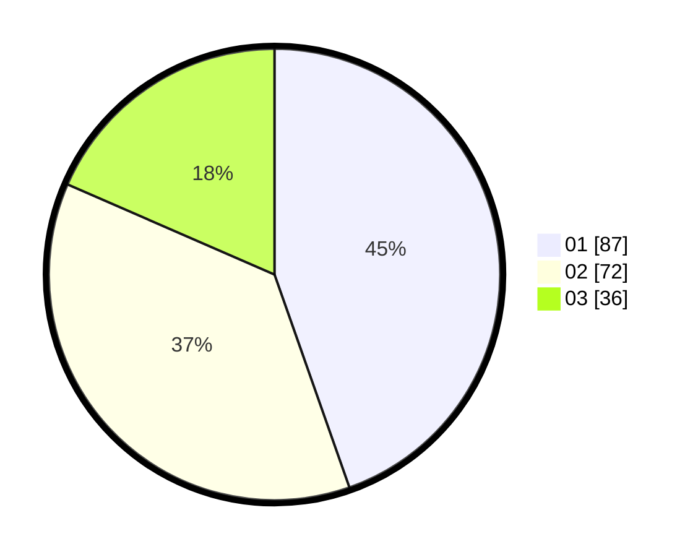

# Hasil

Hasil perolehan suara paslon dapat dilihat pada file paslon-01.txt, paslon-02.txt, dan paslon-03.txt.

Jika tidak ada, artinya data tersebut belum ada pada SIREKAP.

## Perolehan Suara

 * Paslon 01: **87**.
 * Paslon 02: **72**.
 * Paslon 03: **36**.

## Foto C Plano

https://sirekap-obj-formc.kpu.go.id/a8aa/pemilu/ppwp/31/75/01/10/02/3175011002031-20240216-143248--76488250-91eb-4909-bb68-9b3413fc95d1.jpg

https://sirekap-obj-formc.kpu.go.id/a8aa/pemilu/ppwp/31/75/01/10/02/3175011002031-20240216-143250--1cedcbc9-50d0-4266-b29e-c1cb7ab054e7.jpg

https://sirekap-obj-formc.kpu.go.id/a8aa/pemilu/ppwp/31/75/01/10/02/3175011002031-20240216-143249--e4a1dac8-ca45-4ccf-a6e2-c9f91fafe155.jpg

## DATA PEMILIH TETAP

Jumlah pemilih dalam DPT: **0**.
 * L: **0**.
 * P: **0**.

## DATA PENGGUNA HAK PILIH

Jumlah pengguna hak pilih dalam DPT: **0**.
 * L: **0**.
 * P: **0**.

Jumlah pengguna hak pilih dalam DPTb: **0**.
 * L: **0**.
 * P: **0**.

Jumlah pengguna hak pilih dalam DPK: **0**.
 * L: **0**.
 * P: **0**.

Jumlah pengguna hak pilih: **0**.
 * L: **0**.
 * P: **0**.

## JUMLAH SUARA SAH DAN TIDAK SAH

JUMLAH SELURUH SUARA SAH: **195**.

JUMLAH SUARA TIDAK SAH: **2**.

JUMLAH SELURUH SUARA SAH DAN SUARA TIDAK SAH: **197**.
