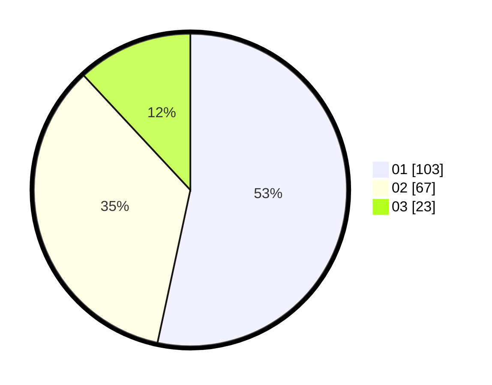

# Hasil

Hasil perolehan suara paslon dapat dilihat pada file paslon-01.txt, paslon-02.txt, dan paslon-03.txt.

Jika tidak ada, artinya data tersebut belum ada pada SIREKAP.

## Perolehan Suara

 * Paslon 01: **103**.
 * Paslon 02: **67**.
 * Paslon 03: **23**.

## Foto C Plano

https://sirekap-obj-formc.kpu.go.id/68da/pemilu/ppwp/31/75/01/10/02/3175011002035-20240214-220546--e368486b-5d18-4e1a-8f0d-1a463292b5f8.jpg

https://sirekap-obj-formc.kpu.go.id/68da/pemilu/ppwp/31/75/01/10/02/3175011002035-20240214-220909--d81733f9-3cf8-4c27-90e0-28abdc3416ec.jpg

https://sirekap-obj-formc.kpu.go.id/68da/pemilu/ppwp/31/75/01/10/02/3175011002035-20240214-221239--10cb437e-f1ef-4d69-86ab-adae5949079a.jpg
