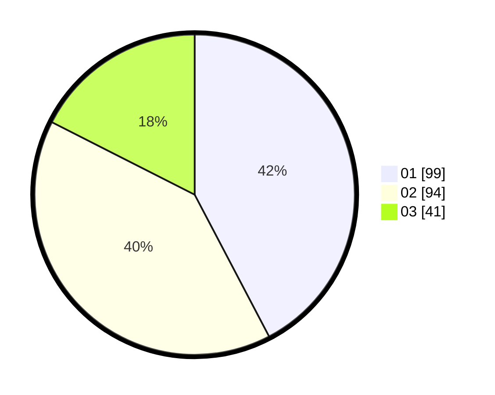

# Hasil

Hasil perolehan suara paslon dapat dilihat pada file paslon-01.txt, paslon-02.txt, dan paslon-03.txt.

Jika tidak ada, artinya data tersebut belum ada pada SIREKAP.

## Perolehan Suara

 * Paslon 01: **99**.
 * Paslon 02: **94**.
 * Paslon 03: **41**.

## Foto C Plano

https://sirekap-obj-formc.kpu.go.id/2554/pemilu/ppwp/31/75/01/10/02/3175011002036-20240216-145455--74644b0d-d2bf-4e6c-a81e-fc929de167e0.jpg

https://sirekap-obj-formc.kpu.go.id/2554/pemilu/ppwp/31/75/01/10/02/3175011002036-20240216-145456--1431c44d-c115-4dc0-b914-9165d07ba0d9.jpg

https://sirekap-obj-formc.kpu.go.id/2554/pemilu/ppwp/31/75/01/10/02/3175011002036-20240216-145456--5738d7fd-36ca-4506-9442-4bc6b067b63b.jpg

## DATA PEMILIH TETAP

Jumlah pemilih dalam DPT: **285**.
 * L: **139**.
 * P: **146**.

## DATA PENGGUNA HAK PILIH

Jumlah pengguna hak pilih dalam DPT: **222**.
 * L: **99**.
 * P: **123**.

Jumlah pengguna hak pilih dalam DPTb: **13**.
 * L: **6**.
 * P: **7**.

Jumlah pengguna hak pilih dalam DPK: **2**.
 * L: **1**.
 * P: **1**.

Jumlah pengguna hak pilih: **237**.
 * L: **106**.
 * P: **131**.

## JUMLAH SUARA SAH DAN TIDAK SAH

JUMLAH SELURUH SUARA SAH: **234**.

JUMLAH SUARA TIDAK SAH: **3**.

JUMLAH SELURUH SUARA SAH DAN SUARA TIDAK SAH: **237**.
