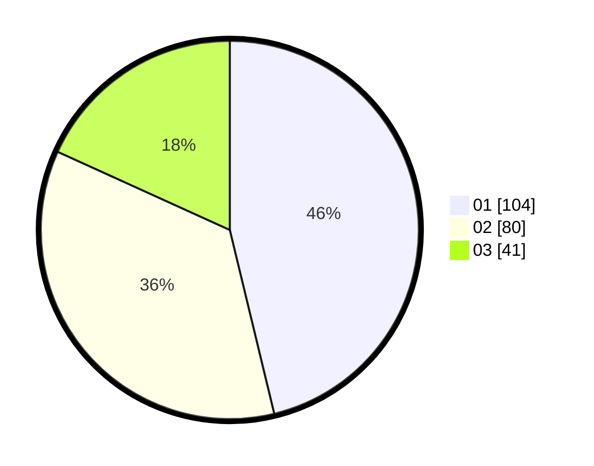

# Hasil

Hasil perolehan suara paslon dapat dilihat pada file paslon-01.txt, paslon-02.txt, dan paslon-03.txt.

Jika tidak ada, artinya data tersebut belum ada pada SIREKAP.

## Perolehan Suara

 * Paslon 01: **104**.
 * Paslon 02: **80**.
 * Paslon 03: **41**.

## Foto C Plano

https://sirekap-obj-formc.kpu.go.id/8b53/pemilu/ppwp/31/75/01/10/02/3175011002037-20240215-015800--55486ee0-0921-4219-a2d6-0d53b5d7f227.jpg

https://sirekap-obj-formc.kpu.go.id/8b53/pemilu/ppwp/31/75/01/10/02/3175011002037-20240215-015908--2914ea45-d6d9-4b6e-8e61-d37e6a2221f5.jpg

https://sirekap-obj-formc.kpu.go.id/8b53/pemilu/ppwp/31/75/01/10/02/3175011002037-20240215-020030--c91ef234-8da9-4f73-9f9a-033fcb54e6f4.jpg
