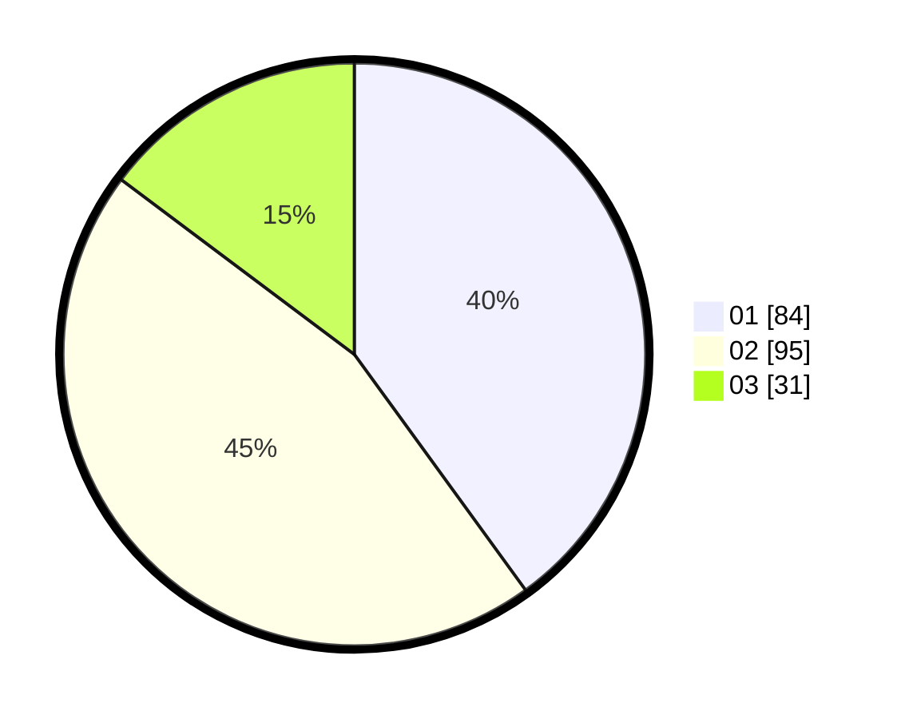

# Hasil

Hasil perolehan suara paslon dapat dilihat pada file paslon-01.txt, paslon-02.txt, dan paslon-03.txt.

Jika tidak ada, artinya data tersebut belum ada pada SIREKAP.

## Perolehan Suara

 * Paslon 01: **84**.
 * Paslon 02: **95**.
 * Paslon 03: **31**.

## Foto C Plano

https://sirekap-obj-formc.kpu.go.id/cedc/pemilu/ppwp/31/75/01/10/02/3175011002038-20240216-000624--e3e89792-f659-4ddf-8ab3-532d3d626949.jpg

https://sirekap-obj-formc.kpu.go.id/cedc/pemilu/ppwp/31/75/01/10/02/3175011002038-20240214-155927--23ac6a25-3faa-430b-9476-bf8f4e56e0eb.jpg

https://sirekap-obj-formc.kpu.go.id/cedc/pemilu/ppwp/31/75/01/10/02/3175011002038-20240214-160056--d8f13a69-d8c5-42cb-919e-2d66bc552b7c.jpg

## DATA PEMILIH TETAP

Jumlah pemilih dalam DPT: **287**.
 * L: **142**.
 * P: **145**.

## DATA PENGGUNA HAK PILIH

Jumlah pengguna hak pilih dalam DPT: **207**.
 * L: **96**.
 * P: **111**.

Jumlah pengguna hak pilih dalam DPTb: **10**.
 * L: **5**.
 * P: **5**.

Jumlah pengguna hak pilih dalam DPK: **0**.
 * L: **0**.
 * P: **0**.

Jumlah pengguna hak pilih: **217**.
 * L: **101**.
 * P: **116**.

## JUMLAH SUARA SAH DAN TIDAK SAH

JUMLAH SELURUH SUARA SAH: **210**.

JUMLAH SUARA TIDAK SAH: **7**.

JUMLAH SELURUH SUARA SAH DAN SUARA TIDAK SAH: **217**.
