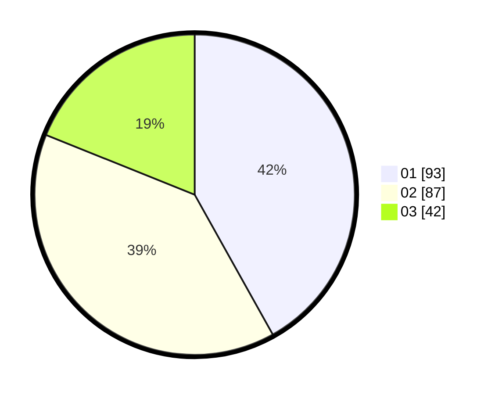

# Hasil

Hasil perolehan suara paslon dapat dilihat pada file paslon-01.txt, paslon-02.txt, dan paslon-03.txt.

Jika tidak ada, artinya data tersebut belum ada pada SIREKAP.

## Perolehan Suara

 * Paslon 01: **93**.
 * Paslon 02: **87**.
 * Paslon 03: **42**.

## Foto C Plano

https://sirekap-obj-formc.kpu.go.id/877e/pemilu/ppwp/31/75/01/10/02/3175011002041-20240215-011457--5a418dc3-d1be-42f3-b743-3eaa12263b04.jpg

https://sirekap-obj-formc.kpu.go.id/877e/pemilu/ppwp/31/75/01/10/02/3175011002041-20240215-005528--401e9507-6337-4c2a-a29f-7902d98cb64c.jpg

https://sirekap-obj-formc.kpu.go.id/877e/pemilu/ppwp/31/75/01/10/02/3175011002041-20240215-012020--9c1d4c6a-e2e8-4468-b044-8df211e9ff0b.jpg

## DATA PEMILIH TETAP

Jumlah pemilih dalam DPT: **262**.
 * L: **126**.
 * P: **136**.

## DATA PENGGUNA HAK PILIH

Jumlah pengguna hak pilih dalam DPT: **214**.
 * L: **96**.
 * P: **118**.

Jumlah pengguna hak pilih dalam DPTb: **7**.
 * L: **4**.
 * P: **3**.

Jumlah pengguna hak pilih dalam DPK: **1**.
 * L: **1**.
 * P: **0**.

Jumlah pengguna hak pilih: **222**.
 * L: **101**.
 * P: **121**.

## JUMLAH SUARA SAH DAN TIDAK SAH

JUMLAH SELURUH SUARA SAH: **222**.

JUMLAH SUARA TIDAK SAH: **0**.

JUMLAH SELURUH SUARA SAH DAN SUARA TIDAK SAH: **222**.
