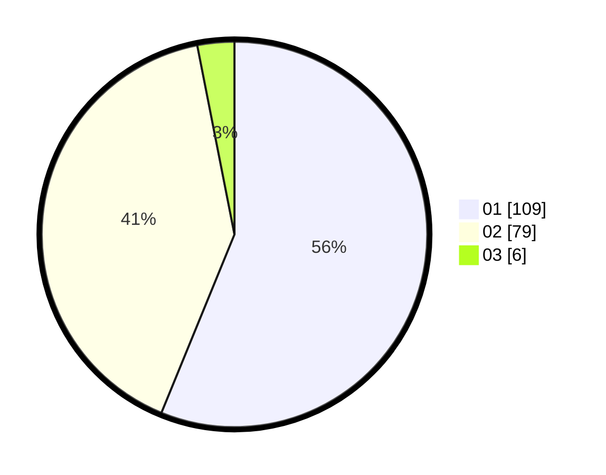

# Hasil

Hasil perolehan suara paslon dapat dilihat pada file paslon-01.txt, paslon-02.txt, dan paslon-03.txt.

Jika tidak ada, artinya data tersebut belum ada pada SIREKAP.

## Perolehan Suara

 * Paslon 01: **109**.
 * Paslon 02: **79**.
 * Paslon 03: **6**.

## Foto C Plano

https://sirekap-obj-formc.kpu.go.id/97fa/pemilu/ppwp/31/75/01/10/02/3175011002042-20240214-162221--7783e320-9c14-4a5b-8a0b-4038d72eb335.jpg

https://sirekap-obj-formc.kpu.go.id/97fa/pemilu/ppwp/31/75/01/10/02/3175011002042-20240214-162226--c3f4ffb2-3086-4605-a859-1e9bc35c540c.jpg
