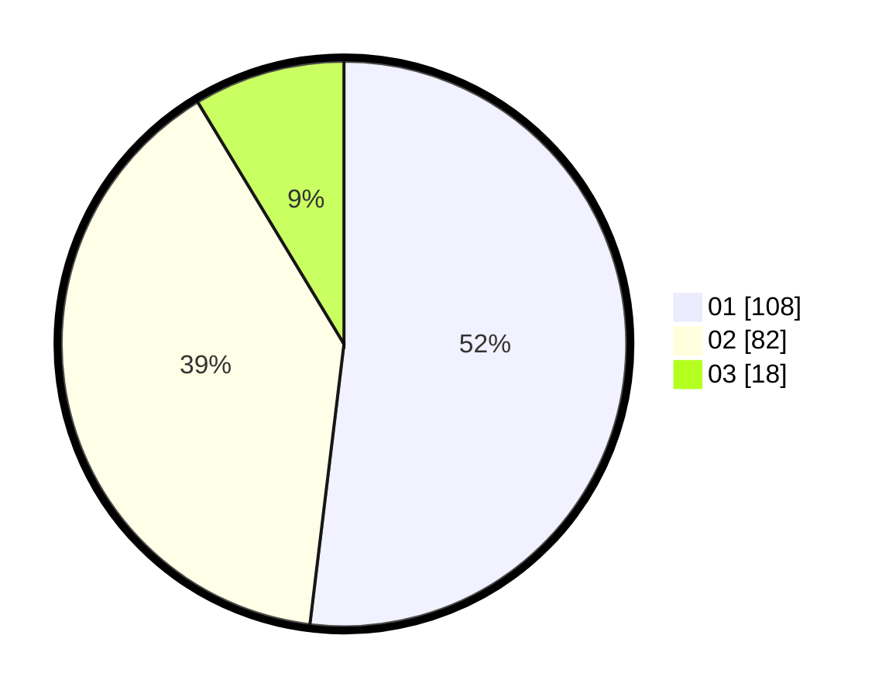

# Hasil

Hasil perolehan suara paslon dapat dilihat pada file paslon-01.txt, paslon-02.txt, dan paslon-03.txt.

Jika tidak ada, artinya data tersebut belum ada pada SIREKAP.

## Perolehan Suara

 * Paslon 01: **108**.
 * Paslon 02: **82**.
 * Paslon 03: **18**.

## Foto C Plano

https://sirekap-obj-formc.kpu.go.id/42bb/pemilu/ppwp/31/75/01/10/02/3175011002043-20240215-025610--47981555-e445-4ff4-b5aa-11f832fc5a05.jpg

https://sirekap-obj-formc.kpu.go.id/42bb/pemilu/ppwp/31/75/01/10/02/3175011002043-20240215-025758--524404e1-2039-4e65-98ab-d49b209395b9.jpg

https://sirekap-obj-formc.kpu.go.id/42bb/pemilu/ppwp/31/75/01/10/02/3175011002043-20240215-041339--90e312fb-58b0-43ea-9ea7-51af44d659dc.jpg
