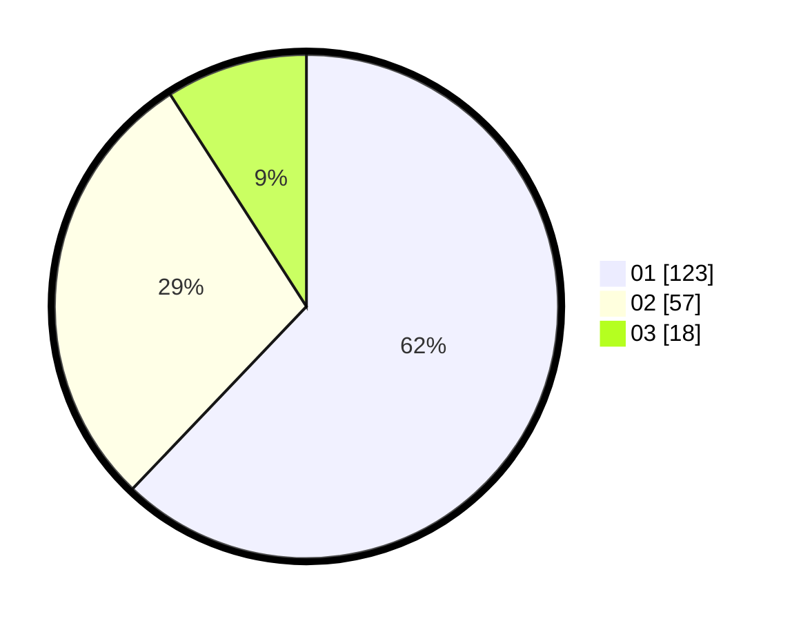

# Hasil

Hasil perolehan suara paslon dapat dilihat pada file paslon-01.txt, paslon-02.txt, dan paslon-03.txt.

Jika tidak ada, artinya data tersebut belum ada pada SIREKAP.

## Perolehan Suara

 * Paslon 01: **123**.
 * Paslon 02: **57**.
 * Paslon 03: **18**.

## Foto C Plano

https://sirekap-obj-formc.kpu.go.id/50c8/pemilu/ppwp/31/75/01/10/02/3175011002044-20240216-120805--bccd82ff-af7d-48be-b489-08f5b410c960.jpg

https://sirekap-obj-formc.kpu.go.id/50c8/pemilu/ppwp/31/75/01/10/02/3175011002044-20240216-120808--ba5220db-b597-4408-9b47-498b1052604d.jpg

https://sirekap-obj-formc.kpu.go.id/50c8/pemilu/ppwp/31/75/01/10/02/3175011002044-20240216-120807--9e0acd6f-a78e-475f-8008-7939435b54fb.jpg

## DATA PEMILIH TETAP

Jumlah pemilih dalam DPT: **262**.
 * L: **115**.
 * P: **147**.

## DATA PENGGUNA HAK PILIH

Jumlah pengguna hak pilih dalam DPT: **199**.
 * L: **86**.
 * P: **113**.

Jumlah pengguna hak pilih dalam DPTb: **2**.
 * L: **2**.
 * P: **0**.

Jumlah pengguna hak pilih dalam DPK: **0**.
 * L: **0**.
 * P: **0**.

Jumlah pengguna hak pilih: **201**.
 * L: **88**.
 * P: **113**.

## JUMLAH SUARA SAH DAN TIDAK SAH

JUMLAH SELURUH SUARA SAH: **198**.

JUMLAH SUARA TIDAK SAH: **3**.

JUMLAH SELURUH SUARA SAH DAN SUARA TIDAK SAH: **201**.
