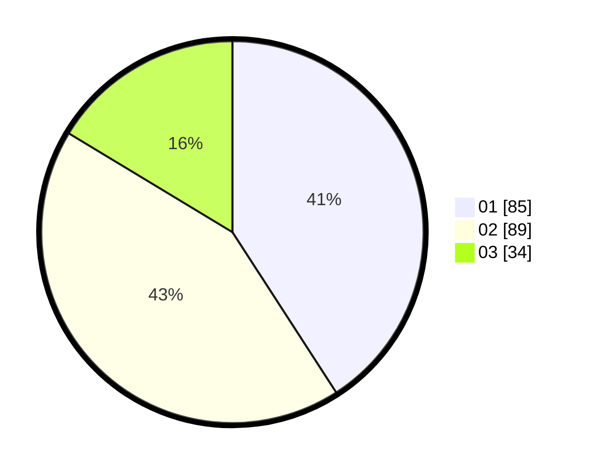

# Hasil

Hasil perolehan suara paslon dapat dilihat pada file paslon-01.txt, paslon-02.txt, dan paslon-03.txt.

Jika tidak ada, artinya data tersebut belum ada pada SIREKAP.

## Perolehan Suara

 * Paslon 01: **85**.
 * Paslon 02: **89**.
 * Paslon 03: **34**.

## Foto C Plano

https://sirekap-obj-formc.kpu.go.id/917d/pemilu/ppwp/31/75/01/10/02/3175011002049-20240214-155853--5c20bd0d-de42-4397-92bb-0644e8926ca5.jpg

https://sirekap-obj-formc.kpu.go.id/917d/pemilu/ppwp/31/75/01/10/02/3175011002049-20240214-225621--0b62c8dd-b069-49c8-a247-2f6acc5ea8cc.jpg

https://sirekap-obj-formc.kpu.go.id/917d/pemilu/ppwp/31/75/01/10/02/3175011002049-20240214-155436--153d2019-ec4f-4633-b05a-1570654dcfd0.jpg
