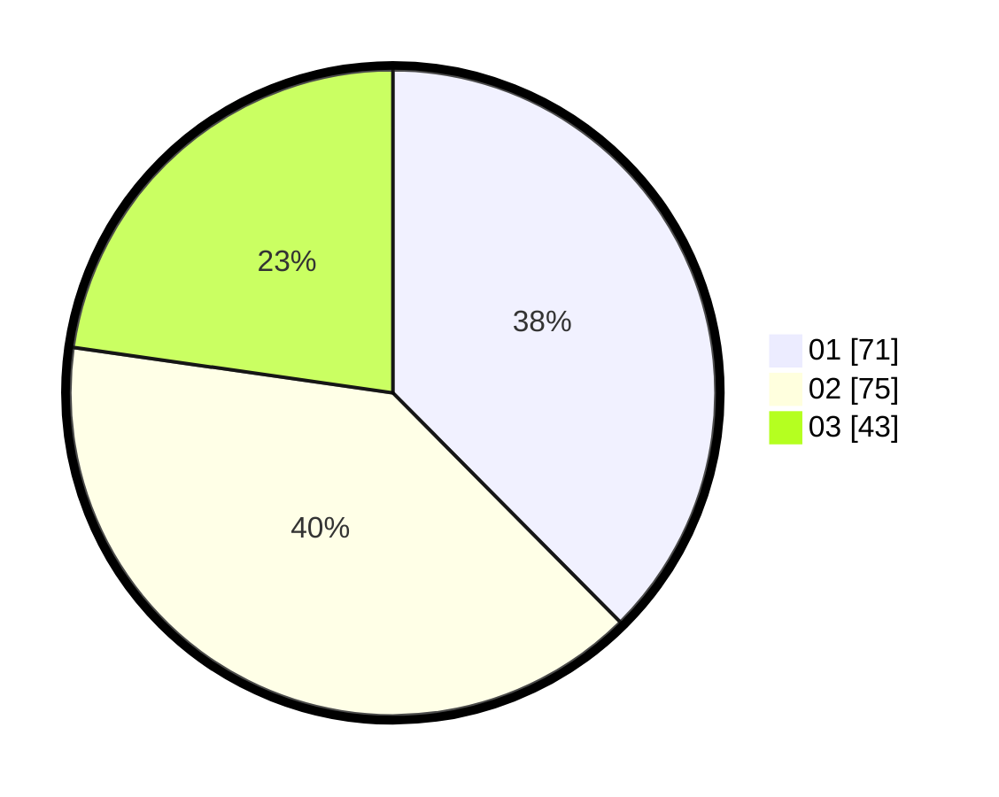

# Hasil

Hasil perolehan suara paslon dapat dilihat pada file paslon-01.txt, paslon-02.txt, dan paslon-03.txt.

Jika tidak ada, artinya data tersebut belum ada pada SIREKAP.

## Perolehan Suara

 * Paslon 01: **71**.
 * Paslon 02: **75**.
 * Paslon 03: **43**.

## Foto C Plano

https://sirekap-obj-formc.kpu.go.id/ddaa/pemilu/ppwp/31/75/01/10/02/3175011002051-20240215-000059--f4b63422-89d7-4488-8172-64d94e9139ae.jpg

https://sirekap-obj-formc.kpu.go.id/ddaa/pemilu/ppwp/31/75/01/10/02/3175011002051-20240215-000300--3be3fdb7-f700-496f-accd-84040d1673e0.jpg

https://sirekap-obj-formc.kpu.go.id/ddaa/pemilu/ppwp/31/75/01/10/02/3175011002051-20240215-000517--84c5c2e5-aad5-4215-807f-369aa2dc2f96.jpg
