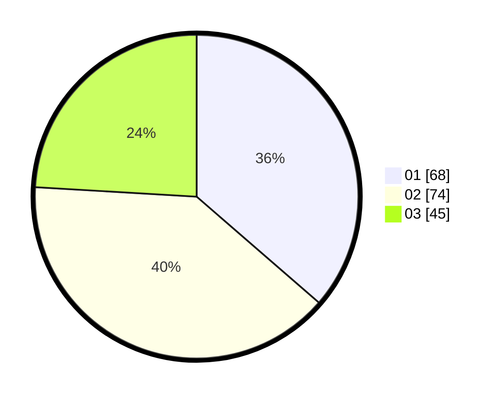

# Hasil

Hasil perolehan suara paslon dapat dilihat pada file paslon-01.txt, paslon-02.txt, dan paslon-03.txt.

Jika tidak ada, artinya data tersebut belum ada pada SIREKAP.

## Perolehan Suara

 * Paslon 01: **68**.
 * Paslon 02: **74**.
 * Paslon 03: **45**.

## Foto C Plano

https://sirekap-obj-formc.kpu.go.id/7eef/pemilu/ppwp/31/75/01/10/02/3175011002052-20240215-022707--94b113c8-4e0e-4303-8d21-645ca4731ac7.jpg

https://sirekap-obj-formc.kpu.go.id/7eef/pemilu/ppwp/31/75/01/10/02/3175011002052-20240215-022613--ad669008-bacb-4a2b-a4c4-e3287880b96e.jpg

https://sirekap-obj-formc.kpu.go.id/7eef/pemilu/ppwp/31/75/01/10/02/3175011002052-20240215-022426--25d5fe0c-b7f1-4f50-ad9d-8791c837df3b.jpg
