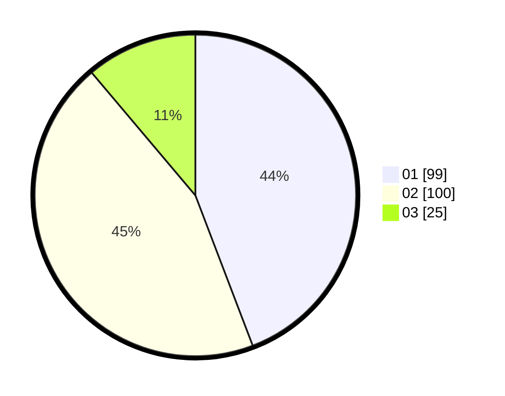

# Hasil

Hasil perolehan suara paslon dapat dilihat pada file paslon-01.txt, paslon-02.txt, dan paslon-03.txt.

Jika tidak ada, artinya data tersebut belum ada pada SIREKAP.

## Perolehan Suara

 * Paslon 01: **99**.
 * Paslon 02: **100**.
 * Paslon 03: **25**.

## Foto C Plano

https://sirekap-obj-formc.kpu.go.id/e1a6/pemilu/ppwp/31/75/01/10/02/3175011002057-20240216-053133--70245c4f-76a1-400a-98d5-fc798e06bd84.jpg

https://sirekap-obj-formc.kpu.go.id/e1a6/pemilu/ppwp/31/75/01/10/02/3175011002057-20240216-053135--3bd1756b-8664-4e27-8fd2-8db115eb90d6.jpg

https://sirekap-obj-formc.kpu.go.id/e1a6/pemilu/ppwp/31/75/01/10/02/3175011002057-20240216-053135--3dc30cd2-9935-4581-b7bf-ca7b25832c0e.jpg

## DATA PEMILIH TETAP

Jumlah pemilih dalam DPT: **227**.
 * L: **110**.
 * P: **117**.

## DATA PENGGUNA HAK PILIH

Jumlah pengguna hak pilih dalam DPT: **227**.
 * L: **110**.
 * P: **117**.

Jumlah pengguna hak pilih dalam DPTb: **0**.
 * L: **0**.
 * P: **0**.

Jumlah pengguna hak pilih dalam DPK: **1**.
 * L: **0**.
 * P: **1**.

Jumlah pengguna hak pilih: **228**.
 * L: **110**.
 * P: **118**.

## JUMLAH SUARA SAH DAN TIDAK SAH

JUMLAH SELURUH SUARA SAH: **224**.

JUMLAH SUARA TIDAK SAH: **4**.

JUMLAH SELURUH SUARA SAH DAN SUARA TIDAK SAH: **228**.
