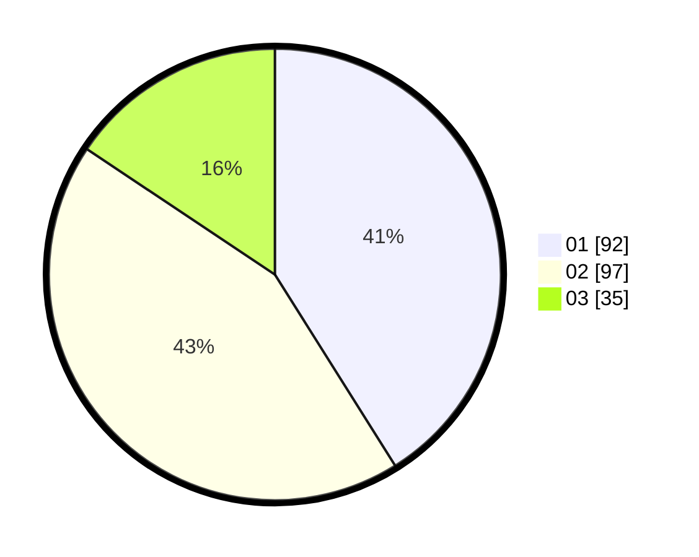

# Hasil

Hasil perolehan suara paslon dapat dilihat pada file paslon-01.txt, paslon-02.txt, dan paslon-03.txt.

Jika tidak ada, artinya data tersebut belum ada pada SIREKAP.

## Perolehan Suara

 * Paslon 01: **92**.
 * Paslon 02: **97**.
 * Paslon 03: **35**.

## Foto C Plano

https://sirekap-obj-formc.kpu.go.id/a743/pemilu/ppwp/31/75/01/10/02/3175011002060-20240215-005850--e4a8f348-446e-4659-873a-d40e8953ab2f.jpg

https://sirekap-obj-formc.kpu.go.id/a743/pemilu/ppwp/31/75/01/10/02/3175011002060-20240215-005928--28782201-7df2-4af9-bb3c-594ac80f0f46.jpg

https://sirekap-obj-formc.kpu.go.id/a743/pemilu/ppwp/31/75/01/10/02/3175011002060-20240215-004949--b05c8904-a2c7-4961-bc95-821db804c437.jpg
