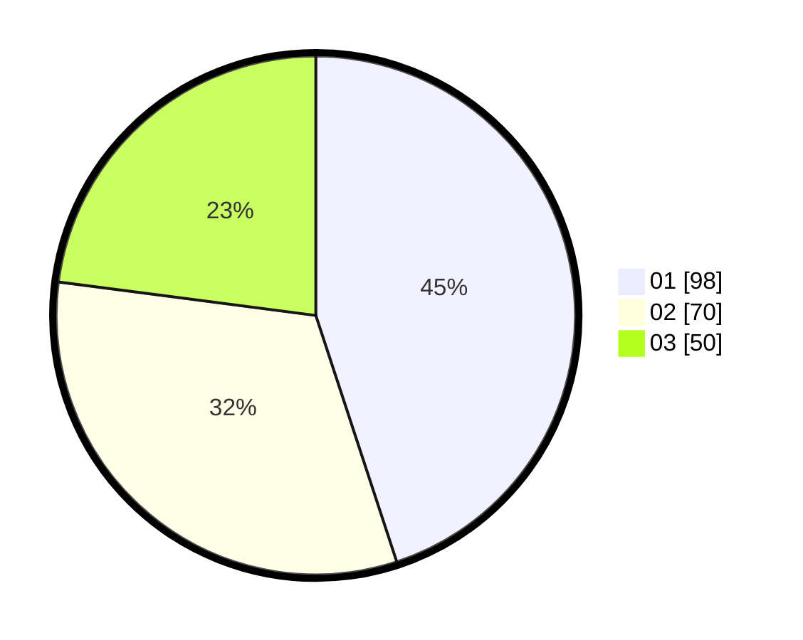

# Hasil

Hasil perolehan suara paslon dapat dilihat pada file paslon-01.txt, paslon-02.txt, dan paslon-03.txt.

Jika tidak ada, artinya data tersebut belum ada pada SIREKAP.

## Perolehan Suara

 * Paslon 01: **98**.
 * Paslon 02: **70**.
 * Paslon 03: **50**.

## Foto C Plano

https://sirekap-obj-formc.kpu.go.id/a660/pemilu/ppwp/31/75/01/10/02/3175011002065-20240216-075007--38a59447-4159-4e73-8df1-b9221e354901.jpg

https://sirekap-obj-formc.kpu.go.id/a660/pemilu/ppwp/31/75/01/10/02/3175011002065-20240216-075009--77f9952a-b85a-44ab-9d2a-d0aff2a25763.jpg

https://sirekap-obj-formc.kpu.go.id/a660/pemilu/ppwp/31/75/01/10/02/3175011002065-20240216-075008--53de6474-7815-4cd7-8c2a-fbc5f83e812a.jpg

## DATA PEMILIH TETAP

Jumlah pemilih dalam DPT: **222**.
 * L: **91**.
 * P: **131**.

## DATA PENGGUNA HAK PILIH

Jumlah pengguna hak pilih dalam DPT: **204**.
 * L: **84**.
 * P: **120**.

Jumlah pengguna hak pilih dalam DPTb: **18**.
 * L: **7**.
 * P: **11**.

Jumlah pengguna hak pilih dalam DPK: **0**.
 * L: **0**.
 * P: **0**.

Jumlah pengguna hak pilih: **222**.
 * L: **91**.
 * P: **131**.

## JUMLAH SUARA SAH DAN TIDAK SAH

JUMLAH SELURUH SUARA SAH: **218**.

JUMLAH SUARA TIDAK SAH: **4**.

JUMLAH SELURUH SUARA SAH DAN SUARA TIDAK SAH: **222**.
