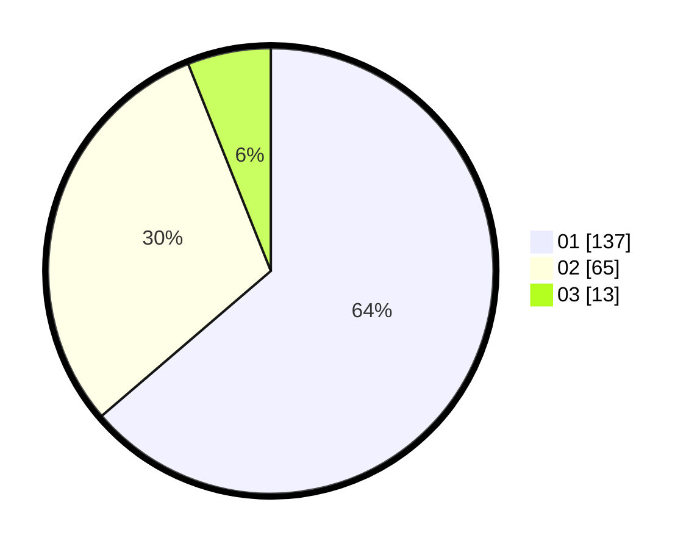

# Hasil

Hasil perolehan suara paslon dapat dilihat pada file paslon-01.txt, paslon-02.txt, dan paslon-03.txt.

Jika tidak ada, artinya data tersebut belum ada pada SIREKAP.

## Perolehan Suara

 * Paslon 01: **137**.
 * Paslon 02: **65**.
 * Paslon 03: **13**.

## Foto C Plano

https://sirekap-obj-formc.kpu.go.id/92af/pemilu/ppwp/31/75/01/10/02/3175011002075-20240214-210246--6274c801-804e-481f-9705-18dd799bed2b.jpg

https://sirekap-obj-formc.kpu.go.id/92af/pemilu/ppwp/31/75/01/10/02/3175011002075-20240214-210445--82591dbf-82e3-47c0-950e-15489437a77d.jpg

https://sirekap-obj-formc.kpu.go.id/92af/pemilu/ppwp/31/75/01/10/02/3175011002075-20240214-210729--bb8b694a-2a99-4db6-8428-91c85f0d545e.jpg

## DATA PEMILIH TETAP

Jumlah pemilih dalam DPT: **278**.
 * L: **135**.
 * P: **143**.

## DATA PENGGUNA HAK PILIH

Jumlah pengguna hak pilih dalam DPT: **217**.
 * L: **104**.
 * P: **113**.

Jumlah pengguna hak pilih dalam DPTb: **3**.
 * L: **1**.
 * P: **2**.

Jumlah pengguna hak pilih dalam DPK: **0**.
 * L: **0**.
 * P: **0**.

Jumlah pengguna hak pilih: **220**.
 * L: **105**.
 * P: **115**.

## JUMLAH SUARA SAH DAN TIDAK SAH

JUMLAH SELURUH SUARA SAH: **215**.

JUMLAH SUARA TIDAK SAH: **5**.

JUMLAH SELURUH SUARA SAH DAN SUARA TIDAK SAH: **220**.
