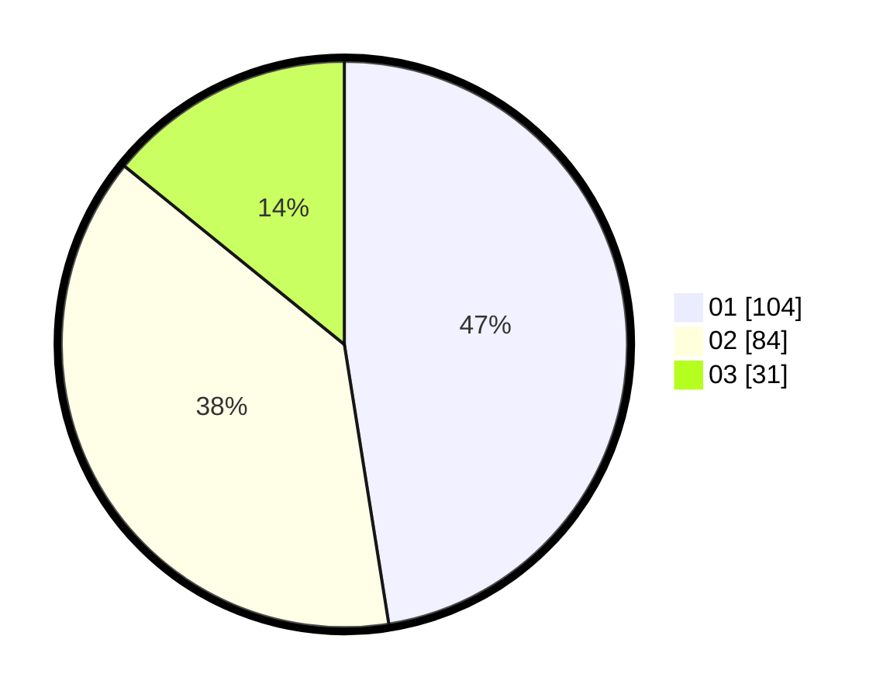

# Hasil

Hasil perolehan suara paslon dapat dilihat pada file paslon-01.txt, paslon-02.txt, dan paslon-03.txt.

Jika tidak ada, artinya data tersebut belum ada pada SIREKAP.

## Perolehan Suara

 * Paslon 01: **104**.
 * Paslon 02: **84**.
 * Paslon 03: **31**.

## Foto C Plano

https://sirekap-obj-formc.kpu.go.id/81ad/pemilu/ppwp/31/75/01/10/02/3175011002077-20240214-192946--7e8412ce-90ae-48e5-8d16-e275b8df2de0.jpg

https://sirekap-obj-formc.kpu.go.id/81ad/pemilu/ppwp/31/75/01/10/02/3175011002077-20240214-194252--96422e03-3dd3-47a6-8f85-83815a783496.jpg

https://sirekap-obj-formc.kpu.go.id/81ad/pemilu/ppwp/31/75/01/10/02/3175011002077-20240216-155629--d8332856-79a6-45de-872a-498dbd9e89af.jpg

## DATA PEMILIH TETAP

Jumlah pemilih dalam DPT: **281**.
 * L: **139**.
 * P: **142**.

## DATA PENGGUNA HAK PILIH

Jumlah pengguna hak pilih dalam DPT: **281**.
 * L: **139**.
 * P: **142**.

Jumlah pengguna hak pilih dalam DPTb: **1**.
 * L: **1**.
 * P: **0**.

Jumlah pengguna hak pilih dalam DPK: **1**.
 * L: **0**.
 * P: **1**.

Jumlah pengguna hak pilih: **283**.
 * L: **140**.
 * P: **143**.

## JUMLAH SUARA SAH DAN TIDAK SAH

JUMLAH SELURUH SUARA SAH: **219**.

JUMLAH SUARA TIDAK SAH: **2**.

JUMLAH SELURUH SUARA SAH DAN SUARA TIDAK SAH: **221**.
