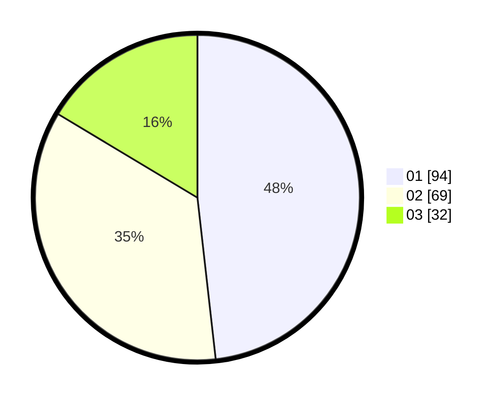

# Hasil

Hasil perolehan suara paslon dapat dilihat pada file paslon-01.txt, paslon-02.txt, dan paslon-03.txt.

Jika tidak ada, artinya data tersebut belum ada pada SIREKAP.

## Perolehan Suara

 * Paslon 01: **94**.
 * Paslon 02: **69**.
 * Paslon 03: **32**.

## Foto C Plano

https://sirekap-obj-formc.kpu.go.id/a2ff/pemilu/ppwp/31/75/01/10/02/3175011002078-20240214-205244--a0f2ffcf-60db-4474-8749-0218b997b0e2.jpg

https://sirekap-obj-formc.kpu.go.id/a2ff/pemilu/ppwp/31/75/01/10/02/3175011002078-20240214-205415--ccf281dd-8f03-4ae3-ab6f-453c8a0d3071.jpg
