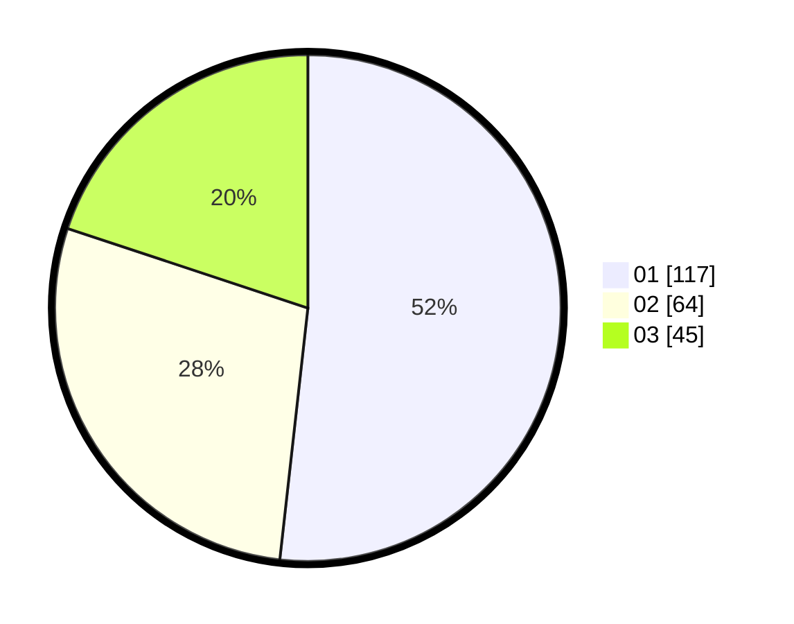

# Hasil

Hasil perolehan suara paslon dapat dilihat pada file paslon-01.txt, paslon-02.txt, dan paslon-03.txt.

Jika tidak ada, artinya data tersebut belum ada pada SIREKAP.

## Perolehan Suara

 * Paslon 01: **117**.
 * Paslon 02: **64**.
 * Paslon 03: **45**.

## Foto C Plano

https://sirekap-obj-formc.kpu.go.id/b729/pemilu/ppwp/31/75/01/10/02/3175011002081-20240214-201432--1bd7f300-39f5-4475-85fd-be00505800f5.jpg

https://sirekap-obj-formc.kpu.go.id/b729/pemilu/ppwp/31/75/01/10/02/3175011002081-20240214-224511--9e015954-df17-4a0e-899b-c1f5ae6421b7.jpg

https://sirekap-obj-formc.kpu.go.id/b729/pemilu/ppwp/31/75/01/10/02/3175011002081-20240214-200801--f16ea4ea-2a9b-44d2-96a1-281e7bf851e0.jpg

## DATA PEMILIH TETAP

Jumlah pemilih dalam DPT: **285**.
 * L: **147**.
 * P: **138**.

## DATA PENGGUNA HAK PILIH

Jumlah pengguna hak pilih dalam DPT: **222**.
 * L: **109**.
 * P: **113**.

Jumlah pengguna hak pilih dalam DPTb: **4**.
 * L: **1**.
 * P: **3**.

Jumlah pengguna hak pilih dalam DPK: **0**.
 * L: **0**.
 * P: **0**.

Jumlah pengguna hak pilih: **226**.
 * L: **110**.
 * P: **116**.

## JUMLAH SUARA SAH DAN TIDAK SAH

JUMLAH SELURUH SUARA SAH: **226**.

JUMLAH SUARA TIDAK SAH: **2**.

JUMLAH SELURUH SUARA SAH DAN SUARA TIDAK SAH: **228**.
