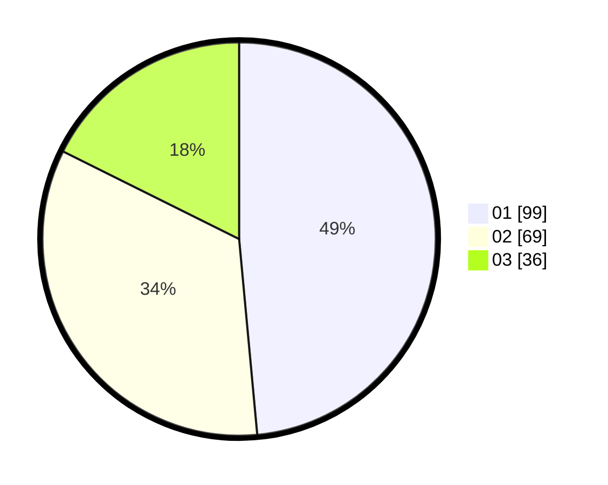

# Hasil

Hasil perolehan suara paslon dapat dilihat pada file paslon-01.txt, paslon-02.txt, dan paslon-03.txt.

Jika tidak ada, artinya data tersebut belum ada pada SIREKAP.

## Perolehan Suara

 * Paslon 01: **99**.
 * Paslon 02: **69**.
 * Paslon 03: **36**.

## Foto C Plano

https://sirekap-obj-formc.kpu.go.id/839c/pemilu/ppwp/31/75/01/10/02/3175011002082-20240214-213632--143a775f-f995-4df5-b0ac-8a9cac2ecdc4.jpg

https://sirekap-obj-formc.kpu.go.id/839c/pemilu/ppwp/31/75/01/10/02/3175011002082-20240214-225028--1970667f-9b08-458c-8259-844ac45e6c1b.jpg

https://sirekap-obj-formc.kpu.go.id/839c/pemilu/ppwp/31/75/01/10/02/3175011002082-20240214-225208--d412905c-dfdc-479d-98e9-ee025668e6bd.jpg
