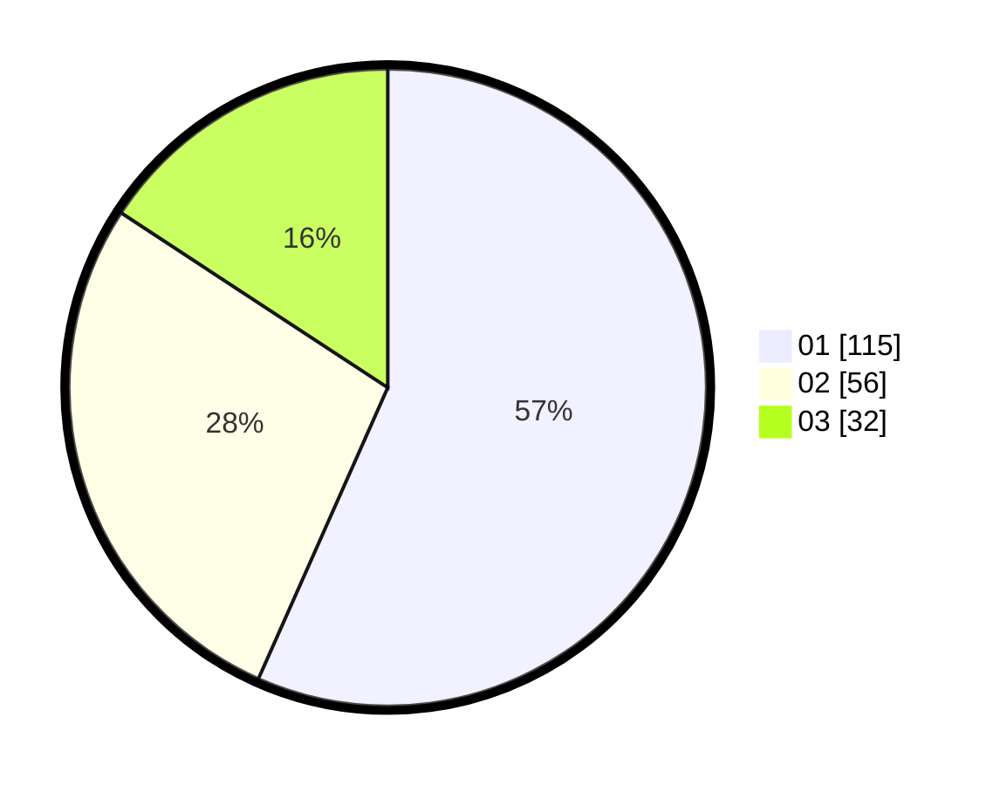

# Hasil

Hasil perolehan suara paslon dapat dilihat pada file paslon-01.txt, paslon-02.txt, dan paslon-03.txt.

Jika tidak ada, artinya data tersebut belum ada pada SIREKAP.

## Perolehan Suara

 * Paslon 01: **115**.
 * Paslon 02: **56**.
 * Paslon 03: **32**.

## Foto C Plano

https://sirekap-obj-formc.kpu.go.id/6df1/pemilu/ppwp/31/75/01/10/02/3175011002083-20240215-000230--bbd2fcb7-8659-4e5d-aaaa-242d57d98bcc.jpg

https://sirekap-obj-formc.kpu.go.id/6df1/pemilu/ppwp/31/75/01/10/02/3175011002083-20240215-000741--d550533e-b64e-4e66-b9a5-b83490417cca.jpg

https://sirekap-obj-formc.kpu.go.id/6df1/pemilu/ppwp/31/75/01/10/02/3175011002083-20240215-000447--0c92dad7-47a3-43c6-a707-af7d8cdebc22.jpg
